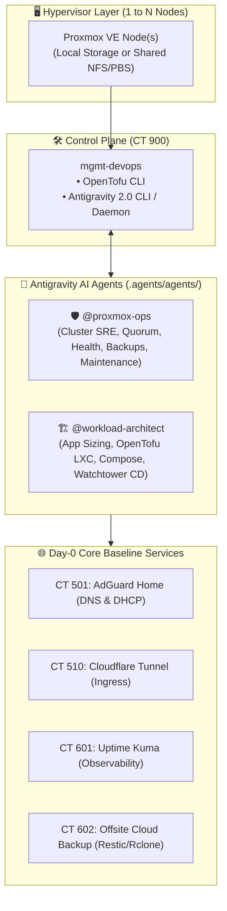
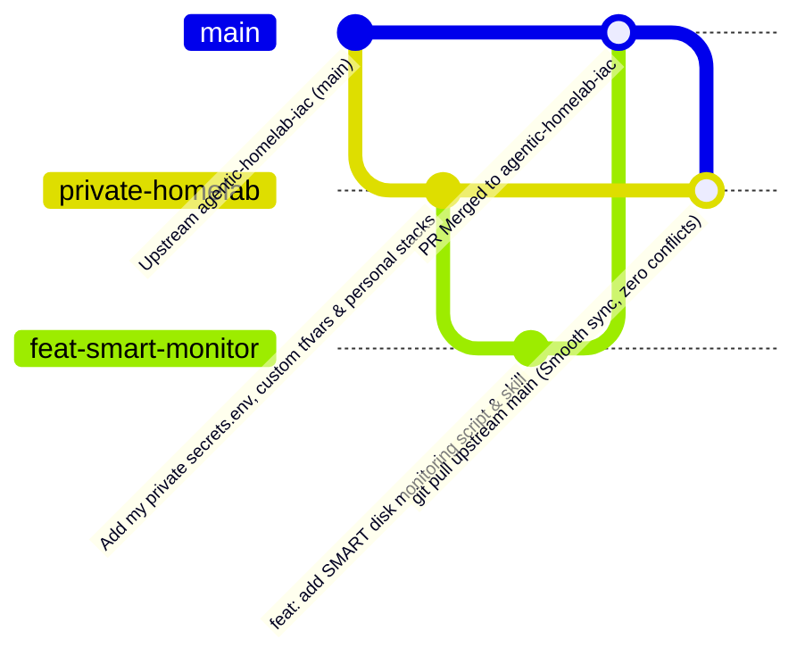

# 🚀 Agentic Homelab IaC (`agentic-homelab-iac`)

[](https://opensource.org/licenses/Apache-2.0)
[](https://opentofu.org/)
[](https://antigravity.google/)
[](https://github.com/aquasecurity/trivy)

Declarative, agentic-first, pedagogical infrastructure-as-code template for **Proxmox VE**. Manage your homelab effortlessly from **1 to N nodes** with an autonomous **AI pair-programmer & SRE team** powered by [Google Antigravity](https://antigravity.google/).

---

## 🌟 Philosophy: Lean Core + Dynamic Agentic Workloads

Most homelab repositories are cluttered with monolithic personal stacks (Plex, torrent clients, niche apps) that break when cloned on different hardware.

`agentic-homelab-iac` takes a modern **Agentic-First** approach:
1. **Pristine 4-Service Baseline**: Deploys only what every homelab needs on Day-0:
   - 🛡️ **AdGuard Home** (`CT 501`): Local DNS resolver, ad-blocking, and DHCP management.
   - 🚇 **Cloudflare Tunnel** (`CT 510`): Zero-trust inbound access without opening firewall ports.
   - 📊 **Uptime Kuma** (`CT 601`): Health monitoring and instant Discord/Telegram alerts.
   - ☁️ **Offsite Cloud Backup** (`CT 602`): Differential client-side encrypted (AES-256) cloud backups (pCloud, S3, B2 via Restic + Rclone) with remote quota alerts.
   - 🛠️ **`mgmt-devops`** (`CT 900`): Dedicated unprivileged IaC control plane running OpenTofu and Antigravity CLI.
2. **Dynamic Workload Scaffolding**: Any additional application (Immich, Plex, Vaultwarden, custom APIs) is designed, sized, and deployed on demand in seconds by asking your AI agent.
3. **Hardware & Topology Agnostic**: Works out-of-the-box on a **single mini-PC** (`local-lvm`/`local-zfs`) or a **multi-node high-availability cluster** with optional NAS (NFS/SMB/PBS) storage.



---

## 📖 Step-by-Step Deployment Tutorial

---

### Step 1: Bare-Metal Proxmox VE Setup

Before cloning this repository, you need at least one functional Proxmox VE hypervisor host.

1. **Install Proxmox VE 8.x**: Follow the [Official Proxmox VE Installation Guide](https://pve.proxmox.com/pve-docs/pve-admin-guide.html#_installation).
2. **Network & Bridge**: Ensure `vmbr0` is configured with an active IP address on your local LAN.
3. *(Optional) Multi-Node Cluster*: If you have multiple machines, join them via [Proxmox Cluster Manager](https://pve.proxmox.com/pve-docs/pve-admin-guide.html#chapter_pvecm) (`pvecm create <name>` and `pvecm add <ip>`).

---

### Step 2: Spawning the `mgmt-devops` Workspace (CT 900)

The only manual step required is spawning the dedicated DevOps management container on your primary Proxmox host.

SSH into your primary Proxmox host shell and execute:

```bash
# Download and execute the one-line management container provisioner
curl -fsSL https://raw.githubusercontent.com/lambertaurelle/agentic-homelab-iac/main/scripts/setup-mgmt-lxc.sh | bash
```

This creates an unprivileged, nested Debian 12 LXC container (`CT 900`: `mgmt-devops`) and installs:
- **OpenTofu** (Open-source Terraform engine)
- **Git**, **cURL**, **jq**, **sudo**
- **1Password CLI** (`op`)
- **Google Antigravity CLI** (`agy`)

Enter the newly created management container:
```bash
pct enter 900
```

---

### Step 3: Day-0 Agentic Cluster Bootstrap

Once inside `mgmt-devops` (`CT 900`):

1. **Clone the Repository**:
   ```bash
   git clone https://github.com/lambertaurelle/agentic-homelab-iac.git /root/homelab-iac
   cd /root/homelab-iac
   ```

2. **Launch Antigravity CLI**:
   ```bash
   agy
   ```

3. **Prompt the Agent**:
   ```text
   Bootstrap my homelab cluster
   ```

The `@proxmox-ops` agent will activate the `proxmox-bootstrap` skill and guide you through:
- Auto-detecting your Proxmox node names and storage pools (`local-lvm`, `local-zfs`).
- Configuring secrets (Proxmox API credentials, optional Cloudflare Tunnel token).
- Running `tofu init` and generating an OpenTofu execution plan for your review.
- Running `tofu apply` and applying post-install configurations for AdGuard, Cloudflared, and Uptime Kuma.
- Outputting an interactive dashboard with all active service endpoints.

---

### Step 4: Day-2 Operations via Antigravity Remote Control

Manage your homelab from anywhere (browser, laptop, or mobile) using **Antigravity Remote Control**:

1. **Enable the Remote Control Service** (inside CT 900):
   ```bash
   ./scripts/install-antigravity-remote.sh install --name mgmt-devops
   ```
2. **Pair with Web UI**: Open [antigravity.google.com](https://antigravity.google.com) and pair your workspace.
3. **Interact with Specialized Agents**:
   - Ask `@proxmox-ops`: *"Run a cluster health check and check for OpenTofu drift"*
   - Ask `@proxmox-ops`: *"Why is container 601 reporting connection timeouts?"*
   - Ask `@proxmox-ops`: *"Perform a safe rolling reboot of the cluster"*

---

### Step 5: Spawning New Workloads with `@workload-architect`

When you want to add a new service to your cluster, invoke `@workload-architect` or ask the main agent:

#### Archetype 1: Custom In-House App (Instant Push-to-Main CD)
> **Prompt**: *"Scaffold a custom Golang API named `weather-api` from GitHub `myuser/weather-api` with instant continuous deployment on port 8080."*

- **What the Agent Does**:
  1. Generates `tofu/ct-weather-api.tf` using `modules/app-container`.
  2. Generates `stacks/weather-api/docker-compose.yml` with a **Watchtower HTTP sidecar**.
  3. Generates `.github/workflows/deploy.yml` snippet with a zero-trust webhook trigger.
  4. Runs `tofu apply` to provision the container.
- **Result**: Pushing code to `main` on GitHub compiles images to GHCR and triggers instant reload in under 10 seconds with **zero cluster SSH keys in GitHub**!

#### Archetype 2: Third-Party Application Stack (e.g. Immich, Vaultwarden, Plex)
> **Prompt**: *"Deploy Immich photo server on my primary node with 4 CPU cores, 8GB RAM, and Intel GPU transcoding passthrough."*

- **What the Agent Does**:
  1. Configures optimal resource sizing and GPU passthrough (`/dev/dri/renderD128`).
  2. Generates `tofu/ct-immich.tf` and `stacks/immich/docker-compose.yml`.
  3. Registers the stack with the nightly `update-cluster-stack.sh` maintenance engine.

#### Archetype 3: Native Bare-Metal Service
> **Prompt**: *"Create a lightweight container running a native Debian WireGuard gateway."*

- **What the Agent Does**:
  1. Allocates an unprivileged LXC with required kernel capabilities (`CAP_NET_ADMIN`).
  2. Configures systemd unit services directly without container overhead.

---

### Step 6: Extending the Agent with Meta-Skills

You can teach your agent new operational runbooks and workflows using the built-in **Meta-Skills Plugin** (`.agents/plugins/meta-skills/`):

1. **Ask the Agent to Build a New Skill**:
   ```text
   Create a new skill for Proxmox ZFS scrub monitoring and SMART disk health audits
   ```
2. **Automatic Creation & Grading**:
   - The agent uses `skill-creator` to scaffold `.agents/plugins/proxmox-iac/skills/proxmox-zfs-health/SKILL.md` + helper script `scripts/check-zfs.sh`.
   - The agent uses `skill-evaluator` to audit and grade the skill against the agentskills.io standard.

---

### Step 7: Private Instance & Upstream Contribution Workflow

To keep your personal running homelab private while contributing improvements upstream:



1. **Clone your private fork / repo**:
   ```bash
   git clone git@github.com:youruser/my-private-homelab.git /root/homelab-iac
   ```
2. **Add the public starter as upstream**:
   ```bash
   git remote add upstream https://github.com/lambertaurelle/agentic-homelab-iac.git
   git fetch upstream
   ```
3. **Document your personal hardware & inventory**:
   Maintain your private hardware profiles, static IP tables, and storage mount mappings under [`docs/instance/`](docs/instance/).
4. **Contribute new generic skills/scripts**:
   ```bash
   git checkout -b feat/new-backup-skill upstream/main
   # (author clean generic script/skill)
   git push origin feat/new-backup-skill
   gh pr create --repo lambertaurelle/agentic-homelab-iac
   ```

---

## 🛠 Repository Directory Structure

```tree
agentic-homelab-iac/
├── .agents/
│   ├── agents/                     # Specialized Custom Agents
│   │   ├── proxmox-ops.md          # SRE & Cluster Operations Agent (@proxmox-ops)
│   │   └── workload-architect.md   # Application Architect Agent (@workload-architect)
│   └── plugins/
│       ├── meta-skills/            # Plugin for authoring & grading skills (skill-creator, skill-evaluator)
│       └── proxmox-iac/            # Proxmox homelab skills plugin
│           ├── plugin.json
│           └── skills/
│               ├── proxmox-bootstrap/      # Day-0 onboarding & provisioning
│               ├── proxmox-cluster-health/ # Read-only health & drift audits
│               ├── proxmox-workload-debug/ # Container logs & troubleshooting
│               ├── proxmox-scaffold-app/   # Workload onboarding & sizing
│               ├── proxmox-maintenance/    # Rolling updates & reboots
│               └── proxmox-offsite-backup/ # Automated differential cloud backup & quota audits
├── AGENTS.md                       # Subagent delegation registry & repository memory
├── CONTRIBUTING.md                 # Community contributing guidelines & PR workflow
├── LICENSE                         # Apache 2.0 Open Source License
├── README.md                       # Pedagogical quick-start & operational guide
├── config/
│   └── backup-targets.example.yaml # Generic offsite backup target dataset template
├── docs/
│   ├── ARCHITECTURE.md             # Topology, storage abstractions, and node models
│   ├── CICD.md                     # CI validation & custom app continuous deployment
│   ├── DISASTER_RECOVERY.md        # Rapid NAS restore & bare-metal rebuild runbooks
│   ├── HOMELAB_APP_ONBOARDING_GUIDE.md # Workload scaffolding & onboarding runbook
│   ├── MAINTENANCE.md              # Operations guide, update engine & rolling reboots
│   ├── SECURITY_EXCEPTIONS.md      # DevSecOps risk acceptance register
│   └── instance/                   # Private instance overlay (topology, hardware, inventory)
├── scripts/
│   ├── bootstrap-docker-host.sh    # Day-0 Docker installer inside LXC
│   ├── bootstrap-secrets.sh        # Generates terraform.tfvars from secrets.env
│   ├── install-adguard.sh          # AdGuard Home setup script
│   ├── install-antigravity-remote.sh # Antigravity Remote Control daemon installer
│   ├── install-cloudflared.sh      # Cloudflare Tunnel connector installer
│   ├── install-offsite-backup.sh   # Offsite cloud backup worker installer (CT 602)
│   ├── manage-backup-targets.sh    # Declarative backup target dataset CLI
│   ├── restore-all-lxc.sh          # Automated VZDump container restoration
│   ├── run-offsite-backup.sh       # Restic + Rclone differential backup runner
│   ├── scaffold-app.sh             # Dynamic 3-mode workload scaffolder CLI
│   ├── scheduled-reboot.sh         # Safe rolling reboot engine
│   ├── setup-discord-alerts.sh     # Discord webhook alerting setup
│   ├── setup-maintenance-cron.sh   # Maintenance cron synchronization
│   ├── setup-mgmt-lxc.sh           # One-line host provisioner for CT 900
│   ├── setup-offsite-backup-schedule.sh # Daily 03:45 AM offsite backup cron installer
│   ├── setup-proxmox-nas-backups.sh # Configures backup storage & VZDump
│   ├── update-cluster-stack.sh     # Daily cluster update engine
│   └── instance/                   # Custom instance installer & maintenance scripts
├── stacks/
│   ├── monitoring/                 # Uptime Kuma Docker Compose Stack (Core Baseline)
│   └── instance/                   # Custom personal Docker Compose stacks (Immich, Seedbox, etc.)
└── tofu/
    ├── ct-adguard.tf               # Core AdGuard Home LXC definition (CT 501)
    ├── ct-cloudflared.tf           # Core Cloudflare Tunnel LXC definition (CT 510)
    ├── ct-monitoring.tf            # Core Uptime Kuma LXC definition (CT 601)
    ├── ct-offsite-backup.tf        # Core Offsite Cloud Backup LXC definition (CT 602)
    ├── outputs.tf                  # Infrastructure outputs
    ├── providers.tf                # OpenTofu bpg/proxmox provider
    ├── terraform.tfvars.example    # Variables configuration template
    ├── variables.tf                # Node & storage agnostic cluster variables
    └── modules/
        └── app-container/          # Reusable declarative application LXC module
```

---

## 🤝 Contributing & Community

While this repository is designed as a starter template and reference architecture, **community ideas, feature suggestions, bug reports, and Pull Requests are warmly welcomed!**

If you'd like to suggest improvements, add new container stack templates, or enhance OpenTofu modules:
- 💡 **Suggest Ideas or Report Bugs**: Open an [Issue](https://github.com/lambertaurelle/agentic-homelab-iac/issues) on GitHub.
- 🔀 **Submit a Pull Request**: Fork the repository, create a branch, run local formatting (`tofu fmt`, `shellcheck`), and submit a PR for review.
- 📖 **Full Guidelines**: Please review our [Contributing Guide](CONTRIBUTING.md) for details on code standards and our PR review process.

---

## 📄 License

Licensed under the **Apache License, Version 2.0**. See [`LICENSE`](LICENSE) for details.
