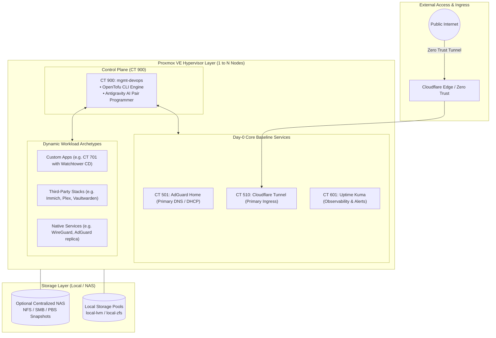
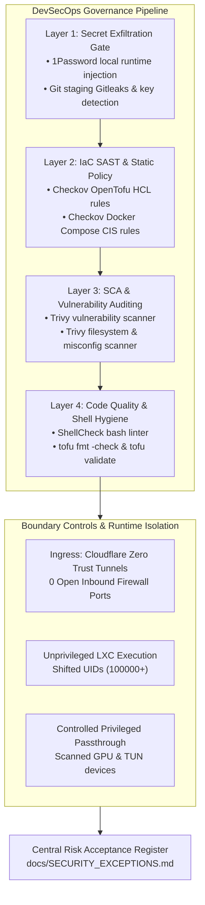

# Homelab Infrastructure Architecture & Topology

Declarative, high-availability, agentic-first homelab infrastructure architecture running on Proxmox VE, managed with OpenTofu, containerized via LXC and Docker Compose, and automated with Google Antigravity.

---

## 🏗 Physical & Compute Topology

The architecture supports flexible topologies ranging from a **single mini-PC** to an **N-node high-availability Proxmox VE cluster** with shared API control plane, deterministic networking, and optional centralized NAS storage.



> 💡 **Instance-Specific Private Overlays**: Custom hardware configurations, personal container stacks, and specialized scripts reside in dedicated `instance/` subdirectories (ignored on the public starter template):
> - **Documentation Overlay ([`docs/instance/`](instance/))**: [Physical Node Specs](instance/TOPOLOGY.md), [Container Inventory & Allocation Matrix](instance/INVENTORY.md), and [Storage & Backup Schedules](instance/STORAGE_AND_BACKUPS.md).
> - **Stacks Overlay ([`stacks/instance/`](../stacks/instance/))**: Private Docker Compose stacks (e.g. Vaultwarden, Media Server, Custom App).
> - **Scripts Overlay ([`scripts/instance/`](../scripts/instance/))**: Custom host installer scripts (e.g. GPU device passthrough, standalone native services).

---

## 🔄 Topology Flexibility & Node Decoupling

The OpenTofu architecture is fully decoupled from physical hostnames and node counts via declarative variables (`tofu/variables.tf`):
- **`utility_node_name`** (Default: `node-1` or `pve`): Hosts cluster lead services, DNS master, ingress primary, monitoring, and management workspaces.
- **`compute_node_name`** (Default: `node-2` or `pve`): Hosts compute-heavy services, media transcoding, and developer workstations.
- **`app_node_name`** (Default: `node-2` or `pve`): Hosts standalone application containers.

```text
┌────────────────────────────────────────────────────────────────────────┐
│                        Proxmox VE Cluster Layouts                      │
├───────────────────────┬────────────────────────┬───────────────────────┤
│   Single-Node Setup   │   Dual-Node Setup      │   Three-Node Scale    │
├───────────────────────┼────────────────────────┼───────────────────────┤
│ utility_node = "pve"  │ utility_node = node-1  │ utility_node = pve-01 │
│ compute_node = "pve"  │ compute_node = node-2  │ compute_node = pve-02 │
│ app_node     = "pve"  │ app_node     = node-2  │ app_node     = pve-03 │
│ (All CTs on 1 host)   │ (Utility + Compute)    │ (Dedicated App Node)  │
└───────────────────────┴────────────────────────┴───────────────────────┘
```

In a single-node environment, setting all three variables to your single Proxmox node allows the entire stack to deploy seamlessly without code modifications.

---

## 📦 Workload Archetypes & Sizing

Workloads onboarded via `@workload-architect` and `scripts/scaffold-app.sh` map to three standard architectural patterns:

| Archetype | Description | Deployment & Update Mechanism | Resource Profile |
| :--- | :--- | :--- | :--- |
| **Type 1: Custom In-House Application** | Personal Git repositories with continuous deployment | In-cluster **Watchtower sidecar** (polls GHCR every 60s or authenticated webhook) | `2 Cores`, `2048 MB RAM`, `20 GB Disk` |
| **Type 2: Third-Party Application Stack** | Standard off-the-shelf Docker Compose stacks (e.g. Immich, Plex, Vaultwarden) | Nightly automated maintenance engine (`scripts/update-cluster-stack.sh` at 05:00 AM) | Sized per workload profile (2-6 Cores, 2-8 GB RAM, optional `/dev/dri` GPU) |
| **Type 3: Native Bare-Metal Service** | Native Debian `.deb` packages or systemd daemons running directly inside an LXC | Debian `apt-get` upgrades via automated maintenance engine | Minimal footprint (`1-2 Cores`, `512-1024 MB RAM`) |

---

## 🛡 High Availability & Redundancy Design

### 1. Dual-Node Active-Active DNS & DHCP Failover
- **Primary DNS / DHCP Server**: `adguard-primary` (CT 501 on Utility Node).
- **Secondary DNS Replica**: `adguard-secondary` (CT 502 on Compute Node).
- **Synchronization**: `adguardhome-sync` synchronizes DNS filters, rewrites, and static DHCP leases between CT 501 and CT 502 every 5 minutes.
- **Failover**: Both DNS server IPs are broadcast to DHCP clients via DHCP Option 6. If either hypervisor restarts, DNS resolution remains uninterrupted.

### 2. Dual-Node Active-Active Cloudflare Ingress
- Two independent `cloudflared` instances (CT 510 on Utility Node and CT 511 on Compute Node) join the same Cloudflare Zero Trust Tunnel connector pool.
- Cloudflare edge automatically balances ingress requests across both nodes and fails over instantly if either node is offline.

### 3. Startup Boot Order Hierarchy
During host reboot or recovery, LXC containers start in strict dependency order:
1. **Order 1 (Delay: 0s)**: Core network & DNS resolver (`CT 501`, `CT 502`).
2. **Order 2 (Delay: 5s)**: External ingress layer (`CT 510`, `CT 511`).
3. **Order 3 (Delay: 10s)**: Application workloads & monitoring (`CT 601`, app containers).
4. **Host Default**: Management Workspace (`CT 900`) & Developer Workstation (`CT 901`).

---

## 🔐 Security Architecture & DevSecOps Governance

The homelab infrastructure enforces a proactive, multi-tier **Defense-in-Depth** security posture:



### DevSecOps Layers
1. **Layer 1: Secret Exfiltration Gate**: 1Password CLI (`op`), Gitleaks, `.gitignore`, and GitHub Secret Push Protection guarantee zero credentials enter git.
2. **Layer 2: IaC SAST & Static Policy**: Checkov (`.checkov.yaml`) audits OpenTofu HCL and Docker Compose YAML against CIS benchmarks.
3. **Layer 3: Dependency SCA**: Trivy (`.trivy.yaml`) scans packages and container layers for known CVEs.
4. **Layer 4: Code Hygiene**: ShellCheck, `tofu fmt`, and `tofu validate` ensure script robustness and schema validity.
