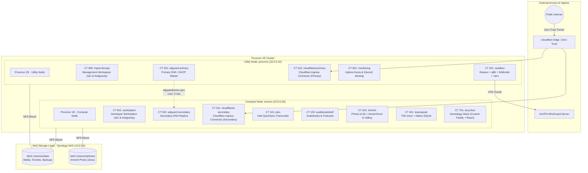
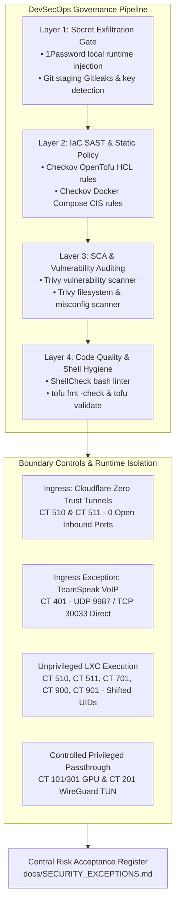

# Homelab Infrastructure Architecture & Topology

Automated, high-availability, multi-node homelab infrastructure running on Proxmox VE, managed declaratively with OpenTofu, containerized via LXC and Docker Compose, and backed by Synology NAS storage.

---

## 🏗 Physical & Compute Topology

The homelab runs across two dedicated Proxmox VE hypervisor nodes unified under a single Proxmox cluster with shared API control plane, deterministic networking, and centralized Synology NFS storage.



### 🔄 Topology Flexibility & Scaling (Single, Dual, or Multi-Node)

The OpenTofu architecture is fully decoupled from physical hostnames and node counts via declarative variables (`tofu/variables.tf`):
- **`utility_node_name`** (Default: `proxmox`): Hosts cluster lead services, DNS master, ingress primary, monitoring, and management workspaces.
- **`compute_node_name`** (Default: `tuxmox`): Hosts compute-heavy services, media transcoding, photo ML/vectors, and developer workstations.
- **`app_node_name`** (Default: `tuxmox`): Hosts standalone application containers (`lecuchon` / CT 701).

```text
┌────────────────────────────────────────────────────────────────────────┐
│                        Proxmox VE Cluster Layouts                      │
├───────────────────────┬────────────────────────┬───────────────────────┤
│   Single-Node Setup   │   Dual-Node (Current)  │   Three-Node Scale    │
├───────────────────────┼────────────────────────┼───────────────────────┤
│ utility_node = "pve"  │ utility_node = proxmox │ utility_node = pve-01 │
│ compute_node = "pve"  │ compute_node = tuxmox  │ compute_node = pve-02 │
│ app_node     = "pve"  │ app_node     = tuxmox  │ app_node     = pve-03 │
│ (All CTs on 1 host)   │ (Utility + Compute)    │ (Dedicated App Node)  │
└───────────────────────┴────────────────────────┴───────────────────────┘
```
In a single-node environment, setting all three variables to your single Proxmox node allows the entire stack to deploy seamlessly without code changes.

---

## 🖥 Node Hardware Specifications

| Property | Utility Node: `proxmox` (Cluster Lead) | Compute Node: `tuxmox` (Compute) |
| :--- | :--- | :--- |
| **Hardware Platform** | 2017 MacBook Pro (15-inch) | TUXEDO InfinityBook Pro 14 - Gen8 |
| **Processor (CPU)** | Intel Core i7-7700HQ (4 Cores / 8 Threads, up to 3.80 GHz) | Intel Core i7-13620H (10 Cores / 16 Threads: 6P + 4E, up to 4.90 GHz) |
| **Graphics (iGPU)** | Intel HD Graphics 630 | Intel Iris Xe Graphics (64 EUs) — Passthrough `/dev/dri/card1` & `/dev/dri/renderD128` |
| **System Memory** | 16 GB LPDDR3 2133 MHz | 32 GB (2x 16 GB) DDR5 4800 MHz SO-DIMM |
| **Local Storage** | 512 GB Apple NVMe SSD (`local-lvm`) | 1 TB Samsung 980 NVMe SSD (`local-lvm`) |
| **Network Interfaces** | 1 Gbps Gigabit Ethernet (USB-C) | 1 Gbps USB 3.0 LAN + Intel Wi-Fi 6E AX211 |
| **Primary Role** | Cluster Lead, DNS/DHCP master, Ingress primary, monitoring, download automation, mgmt workspace | Compute-heavy workloads, Plex hardware transcoding, Immich photo ML/Vector, Audiobookshelf, TeamSpeak, DNS secondary, Ingress secondary |
| **Management IP** | `10.0.0.10` | `10.0.0.20` |

---

## 📦 Container Inventory & Allocation Matrix

All 13 containers are provisioned deterministically via OpenTofu with predictable IDs, hardware sizing, startup ordering, and deterministic MAC addressing (`bc:24:11:00:XX:YY`).

| CTID | Hostname | Node | Cores | RAM (MB) | Swap (MB) | Disk | Privileged | Startup Order | IP Address | MAC Address | Primary Workload |
| :--- | :--- | :--- | :--- | :--- | :--- | :--- | :--- | :--- | :--- | :--- | :--- |
| **101** | `plex` | `tuxmox` | 4 | 4096 | 1024 | 50G | Privileged | `order=3,up=10` | `10.0.0.151` | `bc:24:11:00:01:01` | Plex Media Server + Intel QuickSync HDR (`/dev/dri/card1`, `/dev/dri/renderD128`) |
| **102** | `audiobookshelf` | `tuxmox` | 2 | 2048 | 512 | 16G | Privileged | `order=3,up=10` | `10.0.0.152` | `bc:24:11:00:01:02` | Audiobookshelf server (Native pkg) |
| **201** | `seedbox` | `proxmox` | 4 | 4096 | 1024 | 40G | Privileged | `order=3,up=10` | `10.0.0.161` | `bc:24:11:00:02:01` | Gluetun (AirVPN WireGuard) + qBit + SABnzbd + Prowlarr + Radarr + Sonarr + Seerr + FlareSolverr |
| **301** | `immich` | `tuxmox` | 6 | 8192 | 2048 | 50G | Privileged | `order=3,up=10` | `10.0.0.171` | `bc:24:11:00:03:01` | Immich Server + Machine Learning + PostgreSQL 14 (VectorChord) + Valkey Redis (`valkey:8-bookworm`) + Intel Iris Xe iGPU passthrough (`/dev/dri/renderD128`, `/dev/dri/card1`) |
| **401** | `teamspeak` | `tuxmox` | 2 | 2048 | 512 | 20G | Privileged | `order=3,up=10` | `10.0.0.61` | `bc:24:11:00:04:01` | TeamSpeak 6 Server + Native SQLite (`tsserver.sqlitedb`) |
| **501** | `adguard-primary` | `proxmox` | 2 | 1024 | 512 | 10G | Privileged | `order=1,up=0` | `10.0.0.201` | `bc:24:11:00:05:01` | AdGuard Home (Primary DNS/DHCP) + adguardhome-sync (every 5 min) |
| **502** | `adguard-secondary` | `tuxmox` | 2 | 1024 | 512 | 10G | Privileged | `order=1,up=0` | `10.0.0.202` | `bc:24:11:00:05:02` | AdGuard Home (Secondary DNS Replica) |
| **510** | `cloudflared-primary` | `proxmox` | 1 | 512 | 256 | 8G | Unprivileged | `order=2,up=5` | `10.0.0.66` | `bc:24:11:00:05:10` | Cloudflare Zero Trust Tunnel Connector (Primary) |
| **511** | `cloudflared-secondary` | `tuxmox` | 1 | 512 | 256 | 8G | Unprivileged | `order=2,up=5` | `10.0.0.65` | `bc:24:11:00:05:11` | Cloudflare Zero Trust Tunnel Connector (Secondary) |
| **601** | `monitoring` | `proxmox` | 2 | 1024 | 512 | 16G | Privileged | `order=3,up=10` | `10.0.0.62` | `bc:24:11:00:06:01` | Uptime Kuma Monitoring & Discord Alerting |
| **701** | `lecuchon` | `tuxmox` | 2 | 2048 | 512 | 20G | Unprivileged | Host default | `10.0.0.181` | `bc:24:11:00:07:01` | Le Cuchon Family Genealogy Custom Application (Docker Compose + Instant CD) |
| **900** | `mgmt-devops` | `proxmox` | 2 | 2048 | 512 | 16G | Unprivileged | Host default | `10.0.0.56` | `bc:24:11:00:09:00` | OpenTofu, Git CLI, Antigravity Remote Control Daemon, IaC Management |
| **901** | `workstation` | `tuxmox` | 4 | 8192 | 2048 | 40G | Unprivileged | Host default | `10.0.0.57` | `bc:24:11:00:09:01` | Antigravity Developer Workstation & Remote Control Daemon (`dev` UID 1000) |

---

## 🌐 Network Scheme & Port Allocations

### Subnet Layout
- **LAN Subnet**: `10.0.0.0/24` (Subnet Mask: `255.255.255.0`)
- **Default Gateway / Router**: `10.0.0.1`
- **DNS Upstreams**: Quad9 (`https://dns10.quad9.net/dns-query`), Bootstrap: `9.9.9.10`, `149.112.112.10`
- **High-Availability DNS Endpoints**:
  - Primary DNS: `10.0.0.201` (CT 501)
  - Secondary DNS: `10.0.0.202` (CT 502)

### Complete Service Port Matrix

| Port / Protocol | Service | Host / CTID | Description | Accessibility |
| :--- | :--- | :--- | :--- | :--- |
| **53 / UDP+TCP** | AdGuard Home DNS | CT 501 / CT 502 | Core LAN DNS Resolution | LAN Subnet |
| **67 / UDP** | AdGuard Home DHCP | CT 501 (`adguard-primary`) | Primary LAN DHCP Server | Broadcast |
| **2283 / TCP** | Immich Web & API | CT 301 (`immich`) | Photo & Video Management Web UI | LAN / Cloudflare Tunnel |
| **3000 / TCP** | AdGuard Web UI | CT 501 / CT 502 | AdGuard Administration Dashboard | LAN Subnet |
| **3001 / TCP** | Uptime Kuma | CT 601 (`monitoring`) | Cluster Health Dashboard & Alerting | LAN Subnet |
| **4400-4500 / TCP** | Antigravity Remote Hub | CT 900 / CT 901 | Local Loopback WebUI Hub (Outbound WebRTC/WSS to Antigravity Relay) | Internal CT 900 / CT 901 (`127.0.0.1`) |
| **5055 / TCP** | Seerr (Overseerr) | CT 201 (`seedbox`) | Media Request Management | LAN / Cloudflare Tunnel |
| **7878 / TCP** | Radarr | CT 201 (`seedbox`) | Movie Collection & Indexer Automation | LAN Subnet |
| **8080 / TCP** | adguardhome-sync | CT 501 (`adguard-primary`) | HA Sync API Daemon | Internal CT 501 |
| **8090 / TCP** | qBittorrent WebUI | CT 201 (`seedbox`) | Torrent Client UI (Routed via Gluetun) | LAN Subnet |
| **8181 / TCP** | SABnzbd WebUI | CT 201 (`seedbox`) | Usenet Client Web UI | LAN Subnet |
| **8191 / TCP** | FlareSolverr | CT 201 (`seedbox`) | Cloudflare Challenge Solver | Internal Docker Net |
| **8388 / TCP+UDP** | Shadowsocks Proxy | CT 201 (`seedbox`) | VPN SOCKS/Shadowsocks Proxy | LAN Subnet (Optional) |
| **8888 / TCP** | HTTP Proxy | CT 201 (`seedbox`) | Gluetun Inbound HTTP Proxy | LAN Subnet (Optional) |
| **8989 / TCP** | Sonarr | CT 201 (`seedbox`) | TV Show Automation & Management | LAN Subnet |
| **9696 / TCP** | Prowlarr | CT 201 (`seedbox`) | Torrent & Usenet Indexer Aggregator | LAN Subnet |
| **9987 / UDP** | TeamSpeak 6 Server | CT 401 (`teamspeak`) | TeamSpeak Voice Communication | LAN / Forwarded WAN |
| **13378 / TCP** | Audiobookshelf | CT 102 (`audiobookshelf`) | Audiobooks & Podcasts Web/App API | LAN / Cloudflare Tunnel |
| **30033 / TCP** | TeamSpeak File Xfer | CT 401 (`teamspeak`) | TeamSpeak File Transfer Port | LAN / Forwarded WAN |
| **32400 / TCP** | Plex Media Server | CT 101 (`plex`) | Plex Streaming & Metadata Server | LAN / Remote Access |
| **64321 / UDP+TCP** | AirVPN Forwarded Port | CT 201 (`seedbox`) | High-Speed Torrent Inbound Port | AirVPN WAN Ingress |

---

## 🗄 NAS NFS Storage Matrix

Centralized data storage is provided by a Synology DiskStation NAS at `10.0.0.4` over NFSv4.

| Synology Export | Proxmox Host Mount | LXC Mount Point (`mpX`) | Target Container(s) | Contents & Purpose |
| :--- | :--- | :--- | :--- | :--- |
| `10.0.0.4:/volume2/data` | `/mnt/pve/syno-backup` | — (Proxmox storage) | Cluster storage (`syno-backup`) | Daily vzdump LXC snapshots (`/dump`) |
| `10.0.0.4:/volume2/data` | `/mnt/syno-data` (or `/mnt/nas/data`) | `/mnt/syno-data` (or `/mnt/nas/data`) | CT 101, CT 102, CT 201 | Root shared data share |
| `10.0.0.4:/volume2/data/torrents` | `/mnt/syno-data/torrents` (or `/mnt/nas/data/torrents`) | `/data` | CT 201 (`seedbox`) | Active downloads & completed media |
| `10.0.0.4:/volume2/data/torrents/media/movies` | `/mnt/syno-data/torrents/media/movies` | `/movies` | CT 101 (`plex`) | Movie collection library |
| `10.0.0.4:/volume2/data/torrents/media/series` | `/mnt/syno-data/torrents/media/series` | `/series` | CT 101 (`plex`) | TV series library |
| `10.0.0.4:/volume2/data/audiobookshelf/audiobooks` | `/mnt/syno-data/audiobookshelf/audiobooks` | `/audiobooks` | CT 102 (`audiobookshelf`) | Audiobook library |
| `10.0.0.4:/volume2/data/audiobookshelf/podcasts` | `/mnt/syno-data/audiobookshelf/podcasts` | `/podcasts` | CT 102 (`audiobookshelf`) | Podcast episodes library |
| `10.0.0.4:/volume2/photos` | `/mnt/syno-photos` (or `/mnt/nas/photos`) | `/mnt/syno-photos` (or `/mnt/nas/photos`) | CT 301 (`immich`) | Raw photo/video library (`/library` / `/usr/src/app/upload`) |

---

## 🛡 High Availability & Redundancy Design

### 1. Dual-Node Active-Active DNS & DHCP Failover
- **Primary DNS / DHCP Server**: `adguard-primary` (CT 501 on Utility Node `proxmox` - `10.0.0.201`).
- **Secondary DNS Replica**: `adguard-secondary` (CT 502 on Compute Node `tuxmox` - `10.0.0.202`).
- **Synchronization**: `adguardhome-sync` daemon runs on CT 501 every 5 minutes (`*/5 * * * *`), replicating filters, DNS rewrites, access lists, and static DHCP leases to CT 502.
- **Failover**: Both DNS server IPs (`10.0.0.201` and `10.0.0.202`) are broadcast to all DHCP clients via DHCP Option 6. If either hypervisor restarts, DNS remains uninterrupted.

### 2. Dual-Node Active-Active Cloudflare Tunnels
- Two independent `cloudflared` instances (CT 510 on Utility Node `proxmox` and CT 511 on Compute Node `tuxmox`) join the same Cloudflare Zero Trust Tunnel connector pool.
- Cloudflare automatically balances ingress requests across both nodes and fails over instantly if either node is offline.

### 3. Startup Boot Order Hierarchy
During host reboot or recovery, LXC containers start in strict dependency order:
1. **Order 1 (Delay: 0s)**: `adguard-primary` (CT 501) & `adguard-secondary` (CT 502) — Core network & DNS resolver must be alive first.
2. **Order 2 (Delay: 5s)**: `cloudflared-primary` (CT 510) & `cloudflared-secondary` (CT 511) — External ingress layer.
3. **Order 3 (Delay: 10s)**: Application workloads (`plex`, `audiobookshelf`, `immich`, `seedbox`, `teamspeak`, `monitoring`).
4. **Host Default**: Management Workspace (`mgmt-devops` CT 900), Developer Workstation (`workstation` CT 901), & Custom Workloads (`lecuchon` CT 701) — Managed independently for infrastructure administration, interactive development, and custom applications.

---

## 🔐 Security Architecture & DevSecOps Governance

The homelab infrastructure enforces a proactive, multi-tier **Defense-in-Depth** security posture across hypervisor layers, container boundaries, ingress vectors, and the declarative IaC development lifecycle.



### 1. Defense-in-Depth DevSecOps Model

| Layer | Focus Area | Tools & Mechanisms | Enforcement Stage | Primary Mitigations |
| :--- | :--- | :--- | :--- | :--- |
| **Layer 1: Secret Exfiltration Gate** | Credentials & API Tokens | 1Password CLI (`op`), Gitleaks, `.gitignore`, `detect-private-key` | Pre-commit hook & Local CLI | Zero credentials stored in git; templates inject secrets only into memory/local `.env` with `chmod 600`. |
| **Layer 2: IaC SAST & Static Policy** | Infrastructure Misconfigurations | Checkov (`.checkov.yaml`) | Pre-commit hook & CI runbook | Checks OpenTofu HCL and Docker Compose YAML against CIS benchmarks and security standards. |
| **Layer 3: Container & Dependency SCA** | CVEs & Configuration Drifts | Trivy (`.trivy.yaml`, `.trivyignore`) | Pre-commit hook & Maintenance runs | Scans container images, package manifests, and configuration files for known vulnerabilities. |
| **Layer 4: Code Quality & Shell Hygiene** | Script Robustness & HCL Schema | ShellCheck, `tofu fmt`, `tofu validate` | Pre-commit hook & `scan-security.sh` | Prevents shell injection, unhandled errors, and invalid OpenTofu resource definitions. |

---

### 2. Network Boundary Controls & Ingress Model

#### Cloudflare Zero Trust Tunnels vs. Controlled Direct Exposure
- **Zero Inbound Router Ports (Standard Ingress)**: All inbound web applications (Immich, Seerr, Audiobookshelf) are exposed exclusively through dual active-active Cloudflare Zero Trust Tunnels (`CT 510` on Utility Node `proxmox` and `CT 511` on Compute Node `tuxmox`). No firewall ports (80/443) are forwarded on the LAN edge router.
- **Controlled Low-Latency VoIP Exception (TeamSpeak 6 - CT 401)**:
  - **Requirement**: Real-time voice communication requires UDP port `9987` and file transfer port `TCP 30033` to bypass HTTP reverse-proxy latency and buffering overhead.
  - **Compensating Controls**: TeamSpeak executes as unprivileged user `1000:1000`; uses internal SQLite embedded database (`tsserver.sqlitedb`) without exposed database ports; sensitive query port `10011` is disabled; container is isolated on CT 401 (`10.0.0.61`). Documented in [EXC-002](SECURITY_EXCEPTIONS.md#2-exc-002-teamspeak-direct-host-port-binding).

---

### 3. Container Privilege Containment & Hardware Passthrough

#### Unprivileged Containers by Default
- Ingress connectors (`CT 510`, `CT 511`), Management Workspace (`CT 900`), Developer Workstation (`CT 901`), and Application Workloads (`CT 701`) run in **Unprivileged** LXC mode (`unprivileged = true`). Proxmox VE maps container UID 0 (root) to unprivileged host UID 100000+, neutralizing container escape vectors. On CT 901 and application containers, unprivileged execution is paired with nested virtualization (`nesting = true`) and dedicated non-root execution (`dev` / `app` UID 1000).

#### Controlled Privileged Mode for Hardware Passthrough & Network Namespaces
- **Plex Media Server (`CT 101`)**: Configured with `unprivileged = false` to allow direct access to Intel 13th Gen Iris Xe iGPU character devices (`/dev/dri/renderD128`, `/dev/dri/card1`) for hardware-accelerated HDR tone mapping and transcoding, as well as direct Synology NAS NFS volume bind mounts.
  - *Compensating Controls*: SSH public-key authentication only; media directories isolated with scoped permissions; pinned to internal compute IP `10.0.0.151`. Documented in [EXC-004](SECURITY_EXCEPTIONS.md#4-exc-004-plex-lxc-privileged-mode-for-intel-quicksync-gpu-passthrough).
- **Immich Photo & Video Server (`CT 301`)**: Configured with `unprivileged = false` to enable Intel Iris Xe iGPU character device passthrough (`/dev/dri/renderD128`, `/dev/dri/card1`) for machine learning and video transcoding, nested Docker execution (running Immich Server, Machine Learning, PostgreSQL 14 with VectorChord extension, and Valkey Redis `valkey:8-bookworm`), and Synology NAS NFS photo library mounts (`10.0.0.4:/volume2/photos` -> `/mnt/syno-photos`).
  - *Compensating Controls*: Internal database and cache isolated on private Docker network; web access fronted by Cloudflare Zero Trust; SSH root public-key authentication only.
- **Seedbox VPN Gateway (`CT 201`)**: Configured with `unprivileged = false` to allow Gluetun to configure the Linux `/dev/net/tun` WireGuard kernel interface and mount Synology NAS media storage.
  - *Compensating Controls*: Enforces Docker `security_opt: [no-new-privileges:true]`; child containers (`qbittorrent`, `prowlarr`, etc.) route network exclusively through Gluetun's network namespace with an automatic killswitch preventing traffic leaks if the VPN disconnects. Documented in [EXC-003](SECURITY_EXCEPTIONS.md#3-exc-003-gluetun-vpn-elevated-net_admin-capability) & [EXC-005](SECURITY_EXCEPTIONS.md#active-security-exceptions-register).
- **Audiobookshelf (`CT 102`), TeamSpeak 6 (`CT 401`), AdGuard Home (`CT 501`, `CT 502`), and Monitoring (`CT 601`)**: Configured with `unprivileged = false` for nested container execution, raw network socket bindings (DHCP / DNS on ports 53/67), or direct host NFS storage mount passthrough.

---

### 4. Centralized Risk Governance & Exception Lifecycle

All scanner suppressions across [`.checkov.yaml`](../.checkov.yaml), [`.trivy.yaml`](../.trivy.yaml), and [`.trivyignore`](../.trivyignore) must adhere to the **[DevSecOps Risk Acceptance Register (`docs/SECURITY_EXCEPTIONS.md`)](SECURITY_EXCEPTIONS.md)**:
1. **Mandatory Metadata**: Every suppression must record finding ID, component, justification, compensating controls, approver, and review date.
2. **Strict Time Limits**: Software CVEs have a maximum expiration of 90 days; architectural hardware exceptions undergo an annual review.
3. **Audit Verification**: Pre-commit hooks and [`scripts/scan-security.sh`](../scripts/scan-security.sh) fail builds if unsuppressed findings or undocumented suppressions are detected.

---

## 🚀 Continuous Integration & Instant App Deployment

The homelab uses a clean, two-layer architecture separating **Infrastructure Validation (IaC CI)** from **Application Continuous Deployment (Watchtower CD)**:

```mermaid
flowchart LR
    subgraph IaC_CI ["1. Infrastructure as Code CI (GitHub Cloud)"]
        Commit["Git Commit / PR"] --> CI["GitHub Actions (.github/workflows/ci-cd.yml)"]
        CI --> Checks["ShellCheck + Tofu Validate + Gitleaks"]
    end

    subgraph App_CD ["2. Custom App Continuous Deployment (Push-to-Main)"]
        Dev["Developer Push"] --> GHA["GitHub Actions (App Repo)"]
        GHA -->|Build & Push| GHCR["GitHub Container Registry (ghcr.io)"]
        GHCR -->|60s Auto-Poll or Webhook| WT["Watchtower Sidecar (Auto-polling & Port 8081)"]
        WT -->|Instant Reload (< 10s)| App["Production Workload LXC"]
    end
```

### Key Architectural Principles
1. **Zero Hypervisor Exposure**: GitHub Actions has zero access to the Proxmox API or host SSH keys.
2. **Automated Continuous Deployment**: Custom application containers reload via in-cluster Watchtower automated polling (60s) or authenticated HTTP triggers to the local Watchtower sidecar.
3. **Scheduled Third-Party Updates**: Off-the-shelf stacks (Immich, Seedbox, Kuma) are updated on a daily scheduled cadence via `scripts/update-cluster-stack.sh` at 05:00 AM.
4. **Automated Workload Scaffolding**: New containers and Compose stacks are generated interactively via `scripts/scaffold-app.sh` or the `proxmox-scaffold-app` agent skill.
