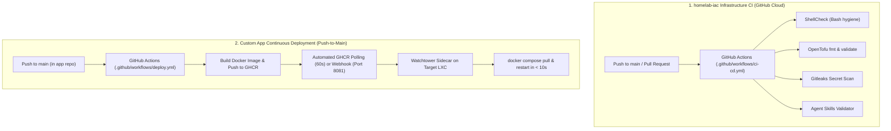

# Homelab CI/CD & Continuous Deployment Runbook

Comprehensive guide for Continuous Integration (CI) validation of the `homelab-iac` repository and automated Continuous Deployment (CD) for custom in-house applications running on Proxmox VE.

---

## 🏗 Overview: Two-Tier Separation

The homelab strictly separates **Infrastructure IaC Validation** from **Application Continuous Deployment**:

---

## 🛡 1. Infrastructure Repository CI (`homelab-iac`)

The `homelab-iac` GitHub Actions workflow runs entirely on cloud runners (`ubuntu-latest`) to validate code quality and security before any infrastructure changes are applied locally:

- **Shell script linting**: Enforces POSIX and bash best practices with `shellcheck`.
- **OpenTofu syntax & schema**: Verifies HCL code formatting (`tofu fmt -check`) and provider definitions (`tofu validate`).
- **Secret leak detection**: Scans commit history with `gitleaks` to guarantee 0 credentials or PII leak into GitHub.
- **Agent skill validation**: Ensures all `.agents/skills/` comply with the agentskills.io specification using `meta-skills`.

### Branch Protection & Pull Request Gates (Public Upstream)
- **Protected `main`**: Force pushes and branch deletions are disallowed.
- **Merge Restrictions**: Only clean Squash or Rebase merges are permitted (merge commits disabled).
- **External PR Security**: Workflows triggered by external forks require maintainer approval and run with strictly `read-only` GITHUB_TOKEN permissions.

---

## ⚡ 2. Custom App Continuous Deployment (Watchtower Auto-Deploy)

For custom applications developed in dedicated repositories (e.g. `lecuchon`), deployment is 100% automated using the in-cluster **Watchtower sidecar**.

### How It Works:
1. When you scaffold a new custom app using `scripts/scaffold-app.sh --type custom --name <app>`, it generates a `docker-compose.yml` with:
   - Your application container tagged `ghcr.io/<repo>:latest` with label `com.centurylinklabs.watchtower.enable=true`
   - A `watchtower` sidecar listening on port `8081` configured with `DOCKER_API_VERSION=1.45`, credentials volume mount, and `--interval 60 --http-api-periodic-polls --label-enable`.
2. In your application's GitHub repository, the `.github/workflows/ci-cd.yml` builds and pushes the image to GHCR.
3. Watchtower inside the Proxmox LXC automatically checks GHCR every 60 seconds. As soon as a new image is pushed, it pulls the image and reloads the container stack in under 10 seconds.
4. *(Optional)* If your container is exposed via a Cloudflare Tunnel or public FQDN, GitHub Actions can additionally trigger `POST /v1/update` on port `8081` for sub-10s instant reload.

### Key Architectural & Security Benefits:
- **Zero Inbound Firewall Holes**: No open ports or public exposure required; Watchtower polls GHCR outbound.
- **Zero SSH Keys in CI**: GitHub Actions requires no SSH private keys, Proxmox tokens, or cluster credentials.
- **Cloud-Native CI/CD**: Cloud runners (`ubuntu-latest`) compile and package images without consuming local homelab CPU/RAM during builds.

---

## 🛠 3. Third-Party Stack Updates (Scheduled)

Off-the-shelf container stacks (Immich, Seedbox, TeamSpeak, Uptime Kuma) do not need continuous deployment triggers. They are automatically pulled and updated daily at **05:00 AM** by [`scripts/update-cluster-stack.sh`](../scripts/update-cluster-stack.sh).
