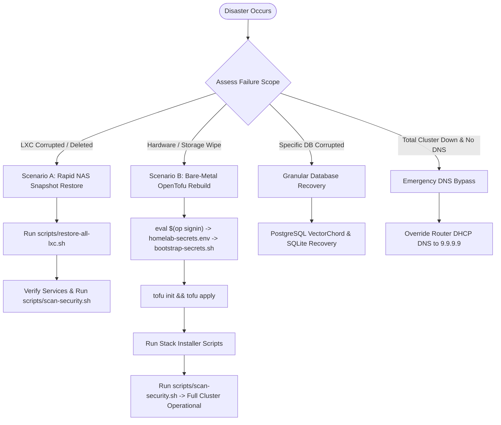

# Homelab Disaster Recovery & Restoration Runbook

Comprehensive Disaster Recovery (DR) runbook for restoring homelab services, individual containers, database engines, and full bare-metal rebuilds from OpenTofu IaC, 1Password secrets, and Synology NAS snapshots.

---

## 🎯 Recovery Objectives & Scenarios Overview

| Objective | Target Metric | Description |
| :--- | :--- | :--- |
| **RTO (Recovery Time Objective)** | **< 5 minutes** | Individual container restoration from Synology NAS VZDump snapshot. |
| **RTO (Bare-Metal Cluster)** | **< 30 minutes** | Complete cluster rebuild from bare metal using OpenTofu + 1Password secrets. |
| **RPO (Recovery Point Objective)** | **< 24 hours** | Maximum snapshot age (daily 03:00 AM backups); 0 data loss for NAS-mounted media and database volumes. |



---

## 📋 Homelab Cluster Architecture & Workload Blueprint

The homelab runs across two dedicated Proxmox VE hypervisors with deterministic container allocations, daily automated VZDump snapshots to Synology NAS (`syno-backup` pool at `10.0.0.4:/volume2/data` mounted at `/mnt/pve/syno-backup/dump`), and centralized secrets bootstrap.

| CTID | Hostname | Cluster Node | Role / Domain Description | Stack & Database Architecture |
| :--- | :--- | :--- | :--- | :--- |
| **101** | `plex` | Compute Node (`tuxmox`) | Media Streaming & Intel QuickSync Transcoding | Native `.deb` package with SQLite database (`com.plexapp.plugins.library.db`) |
| **102** | `audiobookshelf` | Compute Node (`tuxmox`) | Audiobooks & Podcasts Server | Native package with SQLite database (`absdatabase.sqlite`) |
| **201** | `seedbox` | Utility Node (`proxmox`) | Download Automation & VPN Gateway | Docker Compose (`/opt/seedbox`): Gluetun (AirVPN WireGuard), qBittorrent, SABnzbd, Prowlarr, Radarr, Sonarr, Seerr, FlareSolverr |
| **301** | `immich` | Compute Node (`tuxmox`) | Self-Hosted Photo & Video Management | Docker Compose (`/opt/immich`): Immich Server, Machine Learning, PostgreSQL 14 (VectorChord), Valkey Redis |
| **401** | `teamspeak` | Compute Node (`tuxmox`) | TeamSpeak Voice Communication Server | Docker Compose (`/opt/teamspeak`): TeamSpeak 6 Server with native SQLite database (`/opt/teamspeak/config/tsserver.sqlitedb`) |
| **501** | `adguard-primary` | Utility Node (`proxmox`) | Primary DNS Resolver & DHCP Server | Native AdGuard Home binary + `adguardhome-sync` primary daemon |
| **502** | `adguard-secondary` | Compute Node (`tuxmox`) | Secondary DNS Resolver Replica | Native AdGuard Home binary (sync replica from CT 501) |
| **510** | `cloudflared-primary` | Utility Node (`proxmox`) | Cloudflare Zero Trust Ingress Tunnel (Primary) | Native `cloudflared` tunnel connector daemon |
| **511** | `cloudflared-secondary` | Compute Node (`tuxmox`) | Cloudflare Zero Trust Ingress Tunnel (Secondary) | Native `cloudflared` tunnel connector daemon |
| **601** | `monitoring` | Utility Node (`proxmox`) | Uptime Kuma Health Probes & Alerting | Docker Compose (`/opt/monitoring`): Uptime Kuma with SQLite database (`kuma.db`) & Discord alerting webhooks |
| **701** | `lecuchon` | Compute Node (`tuxmox`) | Le Cuchon Family Genealogy Custom Application | Docker Compose (`/opt/lecuchon`): Custom App + Watchtower Instant CD Sidecar |
| **900** | `mgmt-devops` | Utility Node (`proxmox`) | Management Workspace & IaC Orchestration | Unprivileged container running OpenTofu, 1Password CLI, Git CLI, and maintenance automation tooling |
| **901** | `workstation` | Compute Node (`tuxmox`) | Developer Workstation & Remote Workspace | Unprivileged container running Antigravity Remote Control daemon, developer tooling, and non-root `dev` environment |

---

## ⚡ Scenario A: Rapid Restore from Synology NAS Snapshots (< 5 Min)

All containers are backed up daily at 03:00 AM with zstd compression to the Synology NAS storage pool `syno-backup` (`10.0.0.4:/volume2/data` mounted at `/mnt/pve/syno-backup/dump`).

### 1. Discover Available Backups
From Management Workspace (`mgmt-devops`, CT 900) or either Proxmox hypervisor node (`proxmox` / `tuxmox`):

```bash
/root/homelab-iac/scripts/restore-all-lxc.sh --list
```

*Output displays CTID, container name, timestamp, archive size, and filename.*

### 2. Restore a Single Container
To restore an individual corrupted container (e.g. CT 101 Plex or CT 301 Immich):

```bash
# Interactive mode (prompts for confirmation)
/root/homelab-iac/scripts/restore-all-lxc.sh 101

# Non-interactive / Force mode (auto-confirms and starts container)
/root/homelab-iac/scripts/restore-all-lxc.sh 101 --yes

# Restore to custom storage pool if needed
/root/homelab-iac/scripts/restore-all-lxc.sh 301 --storage local-lvm --yes
```

### 3. Restore All Containers (Cluster-Wide Rapid Recovery)
To restore all 13 containers across both nodes (Utility Node `proxmox` and Compute Node `tuxmox`) in a single command:

```bash
/root/homelab-iac/scripts/restore-all-lxc.sh --all --yes
```

### What the restoration script handles automatically:
1. Detects whether the container already exists and checks if it is running.
2. Stops running containers gracefully before restoration.
3. Automatically routes the `pct restore` command to the correct cluster node (Utility Node `proxmox` vs Compute Node `tuxmox`).
4. Re-creates the container rootfs, restores all configuration files, and starts the container.
5. Performs post-restore health verification.

### 4. Post-Restoration Security & Configuration Verification
Immediately after container restoration, run the unified security scanner to verify zero configuration drift, correct privilege boundaries, and absence of exposed credentials:

```bash
/root/homelab-iac/scripts/scan-security.sh
```

**Verification Checklist:**
- **Zero Configuration Drift**: Ensures container privileges (`unprivileged`), capabilities (`CAP_NET_ADMIN`), and bind mounts match declarative OpenTofu policies.
- **Secret Isolation**: Confirms restored `.env` files retain restrictive permissions (`chmod 600`) and no credentials leaked into git tracking.
- **Port Exposure Validation**: Confirms no unauthorized host ports were opened outside registered exceptions ([`docs/SECURITY_EXCEPTIONS.md`](SECURITY_EXCEPTIONS.md)).

---

## 🏗 Scenario B: Total Bare-Metal Rebuild (IaC + 1Password)

Use this scenario if both hypervisors suffer catastrophic drive failure or the entire cluster is wiped.

### Step 1: Base Hypervisor Setup & Cluster Initialization
1. Install Proxmox VE 8.x (Debian 12 Bookworm) on both hardware nodes:
   - Node 1: Utility Node `proxmox` (IP: `10.0.0.10/24`, Gateway: `10.0.0.1`)
   - Node 2: Compute Node `tuxmox` (IP: `10.0.0.20/24`, Gateway: `10.0.0.1`)
2. On Node 1 (Utility Node `proxmox`), create the Proxmox cluster:
   ```bash
   pvecm create homelab-cluster
   ```
3. On Node 2 (Compute Node `tuxmox`), join the cluster:
   ```bash
   pvecm add 10.0.0.10
   ```
4. Verify cluster quorum:
   ```bash
   pvecm status
   ```

### Step 2: Bootstrap Secrets from 1Password & GitHub CLI
1. Clone repository to Management Workspace (`mgmt-devops`) or Utility Node (`proxmox`):
   ```bash
   git clone https://github.com/<your-username>/homelab-iac.git /root/homelab-iac
   cd /root/homelab-iac
   ```
2. Authenticate and retrieve secrets via 1Password CLI (`op`) and GitHub CLI (`gh`):
   ```bash
   # 1. Authenticate with 1Password CLI & GitHub CLI
   eval $(op signin)
   gh auth status

   # 2. Retrieve homelab-secrets.env directly from 1Password vault item:
   op read "op://Private/Homelab Master Secrets/notesPlain" > homelab-secrets.env
   chmod 600 homelab-secrets.env
   ```
3. Generate all environment files, format OpenTofu HCL, and synchronize GitHub repository secrets:
   ```bash
   /root/homelab-iac/scripts/bootstrap-secrets.sh
   ```
   *Generates `tofu/terraform.tfvars`, `stacks/seedbox/.env`, `stacks/immich/.env`, `stacks/teamspeak/.env`, `stacks/monitoring/.env`, formats HCL code with `tofu fmt`, and syncs Discord webhook secrets to GitHub via `gh secret set`.*

### Step 3: Provision All Containers Declaratively with OpenTofu
```bash
cd /root/homelab-iac/tofu

# Initialize OpenTofu provider
tofu init

# Review execution plan
tofu plan

# Deploy all 13 LXC containers across Utility Node (proxmox) and Compute Node (tuxmox)
tofu apply -auto-approve
```

### Step 4: Configure Storage & Restore or Install Workloads

1. **Configure Synology NAS Storage & VZDump Backups**:
   ```bash
   /root/homelab-iac/scripts/setup-proxmox-nas-backups.sh
   ```

2. **Mount Persistent NAS Shares on Hosts**:
   Ensure `/mnt/nas/data` and `/mnt/nas/photos` are mounted in `/etc/fstab`:
   ```bash
   # On Utility Node (proxmox) & Compute Node (tuxmox):
   mkdir -p /mnt/nas/data /mnt/nas/photos
   echo "10.0.0.4:/volume2/data /mnt/nas/data nfs defaults,vers=4 0 0" >> /etc/fstab
   echo "10.0.0.4:/volume2/photos /mnt/nas/photos nfs defaults,vers=4 0 0" >> /etc/fstab
   mount -a
   ```

3. **Install & Start Application Workloads**:
   ```bash
   # Core DNS & DHCP (CT 501 & CT 502)
   /root/homelab-iac/scripts/install-adguard.sh
   /root/homelab-iac/scripts/configure-adguard-dhcp.sh

   # Ingress Tunnels (CT 510 & CT 511)
   pct exec 510 -- bash -c "$(cat /root/homelab-iac/scripts/install-cloudflared.sh)"
   pct exec 511 -- bash -c "$(cat /root/homelab-iac/scripts/install-cloudflared.sh)"

   # Media Streaming (CT 101 & CT 102)
   pct exec 101 -- bash -c "$(cat /root/homelab-iac/scripts/install-plex.sh)"
   pct exec 102 -- bash -c "$(cat /root/homelab-iac/scripts/install-audiobookshelf.sh)"

   # Docker Host Provisioning & Stack Startup (CT 201, CT 301, CT 401, CT 601, CT 701)
   pct exec 201 -- bash -c "$(cat /root/homelab-iac/scripts/bootstrap-docker-host.sh) && cd /opt/seedbox && docker compose up -d"
   pct exec 301 -- bash -c "$(cat /root/homelab-iac/scripts/bootstrap-docker-host.sh) && cd /opt/immich && docker compose up -d"
   pct exec 401 -- bash -c "$(cat /root/homelab-iac/scripts/bootstrap-docker-host.sh) && cd /opt/teamspeak && docker compose up -d"
   pct exec 601 -- bash -c "$(cat /root/homelab-iac/scripts/bootstrap-docker-host.sh) && cd /opt/monitoring && docker compose up -d"
   pct exec 701 -- bash -c "$(cat /root/homelab-iac/scripts/bootstrap-docker-host.sh) && cd /opt/lecuchon && docker compose up -d"

   # Management Workspace Antigravity 2.0 Remote Control Service (CT 900)
   /root/homelab-iac/scripts/install-antigravity-remote.sh install --name mgmt-devops --no-prompt

   # Developer Workstation Provisioning & Antigravity Remote Service (CT 901)
   /root/homelab-iac/scripts/install-workstation.sh
   ```

4. **Install Automated Maintenance Cron Jobs**:
   ```bash
   /root/homelab-iac/scripts/setup-maintenance-cron.sh
   ```

5. **Post-Rebuild Security & Compliance Verification**:
   Execute the comprehensive DevSecOps security audit suite to confirm zero configuration drift, proper privilege encapsulation, and clean secret handling before routing production traffic:
   ```bash
   /root/homelab-iac/scripts/scan-security.sh
   ```

---

## 💾 Granular Database Recovery Runbooks

### 1. Immich Photo Stack (PostgreSQL 14 + VectorChord)
- **Container**: CT 301 (`immich` on Compute Node `tuxmox`)
- **Docker Compose Dir**: `/opt/immich`
- **Database Service**: `immich_postgres` (PostgreSQL 14 with VectorChord extension)

**Backup Database:**
```bash
pct exec 301 -- docker exec -t immich_postgres pg_dump -U immich -d immich -F c -b -v -f /var/lib/postgresql/data/immich_backup.dump
```

**Restore Database:**
```bash
# 1. Stop Immich application server to avoid active transactions
pct exec 301 -- bash -c "cd /opt/immich && docker compose stop immich-server immich-machine-learning"

# 2. Drop existing database and recreate
pct exec 301 -- docker exec -t immich_postgres psql -U immich -d postgres -c "DROP DATABASE immich;"
pct exec 301 -- docker exec -t immich_postgres psql -U immich -d postgres -c "CREATE DATABASE immich;"

# 3. Restore from dump archive
pct exec 301 -- docker exec -t immich_postgres pg_restore -U immich -d immich -v /var/lib/postgresql/data/immich_backup.dump

# 4. Restart Immich stack
pct exec 301 -- bash -c "cd /opt/immich && docker compose up -d"
```

---

### 2. TeamSpeak 6 Voice Server (SQLite)
- **Container**: CT 401 (`teamspeak` on Compute Node `tuxmox`)
- **Docker Compose Dir**: `/opt/teamspeak`
- **Database File**: `/opt/teamspeak/config/tsserver.sqlitedb`

**Check Database Integrity:**
```bash
pct exec 401 -- sqlite3 /opt/teamspeak/config/tsserver.sqlitedb "PRAGMA integrity_check;"
```

**Backup Database & Configuration:**
```bash
pct exec 401 -- bash -c "sqlite3 /opt/teamspeak/config/tsserver.sqlitedb '.backup /tmp/tsserver_backup.sqlitedb'"
pct exec 401 -- tar -czf /tmp/teamspeak_full_config.tar.gz -C /opt/teamspeak/config .
```

**Restore Database:**
```bash
# 1. Stop TeamSpeak server container
pct exec 401 -- bash -c "cd /opt/teamspeak && docker compose stop teamspeak"

# 2. Restore SQLite database snapshot
pct exec 401 -- cp /tmp/tsserver_backup.sqlitedb /opt/teamspeak/config/tsserver.sqlitedb
pct exec 401 -- chown 1000:1000 /opt/teamspeak/config/tsserver.sqlitedb

# 3. Start TeamSpeak server
pct exec 401 -- bash -c "cd /opt/teamspeak && docker compose start teamspeak"
```

---

### 3. Plex Media Server (SQLite)
- **Container**: CT 101 (`plex` on Compute Node `tuxmox`)
- **Database File**: `/var/lib/plexmediaserver/Library/Application Support/Plex Media Server/Plug-in Support/Databases/com.plexapp.plugins.library.db`

**Check Database Integrity:**
```bash
pct exec 101 -- sqlite3 "/var/lib/plexmediaserver/Library/Application Support/Plex Media Server/Plug-in Support/Databases/com.plexapp.plugins.library.db" "PRAGMA integrity_check;"
```

**Restore from Automatic Backup:**
Plex automatically stores rolling backups in the `Databases/` folder.
```bash
# 1. Stop Plex Media Server
pct exec 101 -- systemctl stop plexmediaserver

# 2. Locate latest automatic backup
pct exec 101 -- ls -la "/var/lib/plexmediaserver/Library/Application Support/Plex Media Server/Plug-in Support/Databases/"

# 3. Restore backup
pct exec 101 -- bash -c '
DB_DIR="/var/lib/plexmediaserver/Library/Application Support/Plex Media Server/Plug-in Support/Databases"
LATEST_BACKUP=$(ls -1t "${DB_DIR}"/com.plexapp.plugins.library.db-20* | head -n 1)
cp "${LATEST_BACKUP}" "${DB_DIR}/com.plexapp.plugins.library.db"
chown plex:plex "${DB_DIR}/com.plexapp.plugins.library.db"
'

# 4. Restart Plex
pct exec 101 -- systemctl start plexmediaserver
```

---

### 4. Audiobookshelf (SQLite)
- **Container**: CT 102 (`audiobookshelf` on Compute Node `tuxmox`)
- **Database File**: `/var/lib/audiobookshelf/config/absdatabase.sqlite`

**Restore Database:**
```bash
# 1. Stop Audiobookshelf service
pct exec 102 -- systemctl stop audiobookshelf

# 2. Restore backup copy
pct exec 102 -- cp /var/lib/audiobookshelf/backups/latest.sqlite /var/lib/audiobookshelf/config/absdatabase.sqlite
pct exec 102 -- chown -R audiobookshelf:audiobookshelf /var/lib/audiobookshelf

# 3. Restart Audiobookshelf
pct exec 102 -- systemctl start audiobookshelf
```

---

### 5. Uptime Kuma Monitoring Stack (SQLite)
- **Container**: CT 601 (`monitoring` on Utility Node `proxmox`)
- **Docker Compose Dir**: `/opt/monitoring`
- **Database File**: `/opt/monitoring/data/kuma.db`

**Check Database Integrity:**
```bash
pct exec 601 -- sqlite3 /opt/monitoring/data/kuma.db "PRAGMA integrity_check;"
```

**Backup Database & Data Volume:**
```bash
pct exec 601 -- bash -c "sqlite3 /opt/monitoring/data/kuma.db '.backup /tmp/kuma_backup.db'"
pct exec 601 -- tar -czf /tmp/monitoring_data_backup.tar.gz -C /opt/monitoring/data .
```

**Restore Database:**
```bash
# 1. Stop Uptime Kuma container
pct exec 601 -- bash -c "cd /opt/monitoring && docker compose stop uptime-kuma"

# 2. Restore SQLite database snapshot
pct exec 601 -- cp /tmp/kuma_backup.db /opt/monitoring/data/kuma.db

# 3. Start Uptime Kuma container
pct exec 601 -- bash -c "cd /opt/monitoring && docker compose start uptime-kuma"

---

## 🚨 Emergency DNS Bypass & Cluster Outage Recovery

If both hypervisors or both AdGuard Home instances (`10.0.0.201` and `10.0.0.202`) are offline, client devices on the LAN will lose domain name resolution.

### Method 1: Router DHCP DNS Override (Fastest LAN Fix)
1. Access router web administration interface (`http://10.0.0.1`).
2. Navigate to **DHCP / LAN Settings**.
3. Update Primary and Secondary DNS servers from `10.0.0.201` / `10.0.0.202` to:
   - Primary: `9.9.9.9` (Quad9) or `1.1.1.1` (Cloudflare)
   - Secondary: `149.112.112.112` or `1.0.0.1`
4. Save and renew DHCP leases on connected client devices.

### Method 2: Client-Side Immediate Temporary Fix (Linux / macOS)
```bash
# Linux / macOS manual resolv.conf override
echo "nameserver 9.9.9.9" | sudo tee /etc/resolv.conf
```

### Method 3: Direct Proxmox Hypervisor Web UI Access
Even if DNS resolution is completely down, all nodes and services remain accessible via direct IP:
- **Utility Node (`proxmox`) UI**: `https://10.0.0.10:8006/`
- **Compute Node (`tuxmox`) UI**: `https://10.0.0.20:8006/`
- **Synology NAS UI**: `http://10.0.0.4:5000/`
- **Primary Router UI**: `http://10.0.0.1/`
