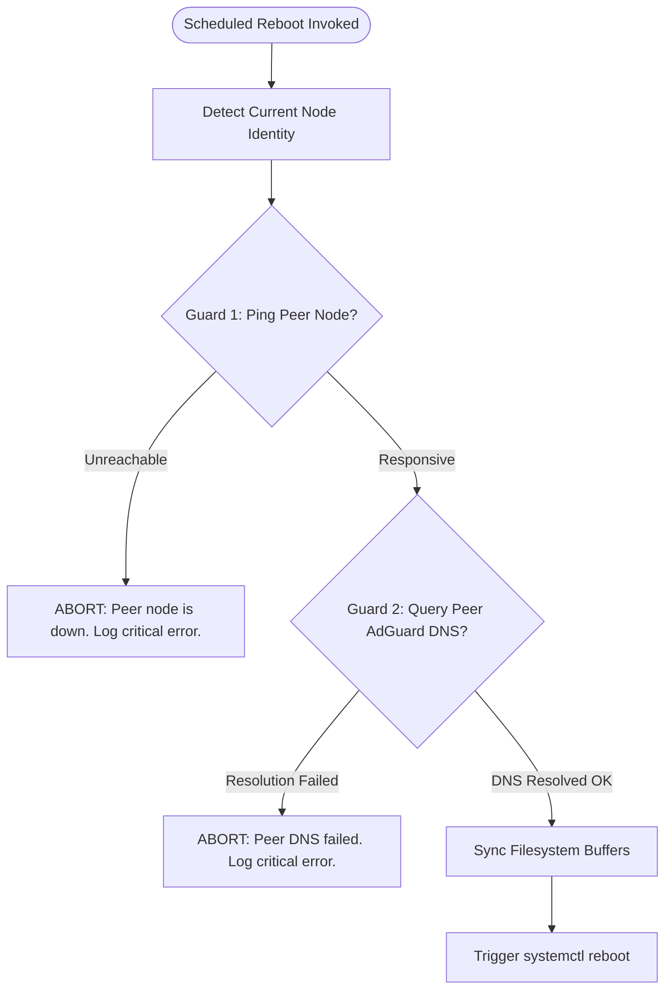
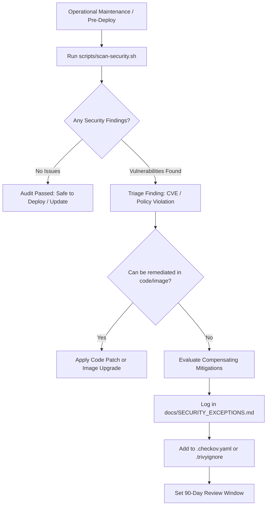

# Homelab Operations & Maintenance Guide

Comprehensive operational guide for automated updates, rolling reboot scheduling with failover guards, backup lifecycle management, and standard procedures for onboarding new workloads into the homelab infrastructure.

---

## 📅 Automated Maintenance Schedules

All maintenance operations in the homelab are fully automated, logged, and designed around zero downtime and high availability.

```mermaid
gantt
    title Automated Daily & Weekly Maintenance Timeline
    dateFormat HH:mm
    axisFormat %H:%M

    section Daily Backups
    NAS VZDump Snapshots (03:00)       :active, 03:00, 30m

    section Weekly Rolling Reboots
    Utility Node proxmox Reboot (Sun 04:00) :crit, 04:00, 15m
    Compute Node tuxmox Reboot (Mon 04:00)  :crit, 04:00, 15m

    section Daily Updates
    Cluster Stack Update Engine (05:00):done, 05:00, 30m

    section Daily Security Audit
    DevSecOps Compliance Scan (05:30)  :active, 05:30, 15m

    section Continuous HA Sync
    AdGuard HA Sync (Every 5 min)      :milestone, 00:00, 0m
```



| Schedule | Target / Scope | Script / Tool | Description & Guards | Log Location |
| :--- | :--- | :--- | :--- | :--- |
| **Daily 03:00 AM** | All 13 LXC Containers | `/etc/pve/vzdump.cron` | Daily zstd-compressed VZDump snapshot backups to Synology NAS (`syno-backup`). Retention: 3 daily, 2 weekly. | `/var/log/vzdump.log` |
| **Sunday 04:00 AM** | Utility Node (`proxmox`) | `scripts/scheduled-reboot.sh` | Weekly rolling reboot of Utility Node. Requires Compute Node (`tuxmox`) and Secondary DNS (`10.0.0.202`) to be healthy. | `/var/log/homelab-reboot.log` |
| **Monday 04:00 AM** | Compute Node (`tuxmox`) | `scripts/scheduled-reboot.sh` | Weekly rolling reboot of Compute Node. Requires Utility Node (`proxmox`) and Primary DNS (`10.0.0.201`) to be healthy. | `/var/log/homelab-reboot.log` |
| **Daily 05:00 AM** | Both Nodes & 13 Containers | `scripts/update-cluster-stack.sh` | OS dist-upgrade across hypervisors and all 13 LXC containers, native app updates (Plex, ABS, AdGuard, adguardhome-sync, Cloudflared, Antigravity CLI, GitHub Actions Runner), Docker Compose pull, restart, and image prune. | `/var/log/homelab-updates.log` |
| **Daily 05:30 AM** | Hypervisors & Management Workspace | `scripts/scan-security.sh` | Daily automated DevSecOps scan (Trivy, Checkov, Gitleaks, ShellCheck, Tofu fmt/validate), Discord security webhook dispatch, and markdown audit reports. | `/var/log/homelab-security-audit.log` |
| **Every 5 Minutes** | Primary AdGuard (CT 501) | `adguardhome-sync.service` | Bi-directional replication of DNS rules, rewrites, and static DHCP leases from CT 501 to CT 502. | `journalctl -u adguardhome-sync` |

---

## 🔄 Automated Stack Update Engine (`scripts/update-cluster-stack.sh`)

The update engine provides end-to-end patching across hypervisors, native LXC packages, and nested Docker Compose applications.

### Update Workflow Stages

1. **Stage 1: Proxmox VE Host Updates**
   - Refreshes Proxmox repository indexes (`pve-no-subscription`) and Debian packages, executing `apt-get dist-upgrade -y` with non-interactive dpkg flags on both the Utility Node (`proxmox`) and Compute Node (`tuxmox`).
   - Error-resilient host processing ensures container and stack updates continue even during intermittent upstream mirror delays.
   - Cleans orphaned packages and apt cache (`apt-get autoremove`, `apt-get clean`).

2. **Stage 2: LXC Container OS Updates**
   - Iterates through all 13 running containers across both nodes (`101`, `102`, `201`, `301`, `401`, `501`, `502`, `510`, `511`, `601`, `701`, `900`, `901`):
     - **Utility Node (`proxmox`)**: CT 201 (`seedbox`), CT 501 (`adguard-primary`), CT 510 (`cloudflared-primary`), CT 601 (`monitoring`), CT 900 (`mgmt-devops`).
     - **Compute Node (`tuxmox`)**: CT 101 (`plex`), CT 102 (`audiobookshelf`), CT 301 (`immich`), CT 401 (`teamspeak`), CT 502 (`adguard-secondary`), CT 511 (`cloudflared-secondary`), CT 701 (`lecuchon`), CT 901 (`workstation`).
   - Executes Debian security and package upgrades inside each container via `pct exec`.

3. **Stage 3: Native Application Updates**
   - **Plex Media Server (CT 101)**: Queries official Plex Downloads API (`https://plex.tv/api/downloads/5.json`) for latest upstream direct package release (`.deb`), falling back to official Plex Debian APT repository (`https://downloads.plex.tv/repo/deb`), and restarts service if needed.
   - **Audiobookshelf (CT 102)**: Upgrades `audiobookshelf` package and validates service health.
   - **AdGuard Home (CT 501 & CT 502)**: Invokes `/opt/AdGuardHome/AdGuardHome --update` and restarts systemd service.
   - **adguardhome-sync (CT 501)**: Queries GitHub API for new release binaries and installs updates automatically.
   - **Cloudflared (CT 510 & CT 511)**: Downloads latest Cloudflare Debian release package, upgrades, and verifies tunnel connectivity.
   - **Antigravity CLI & Remote Control Daemon (CT 900 & CT 901)**:
     - **CT 900 (`mgmt-devops`)**: Upgrades Antigravity CLI binary via `agy update` and restarts the background root user service (`agy-remote-control.service`).
     - **CT 901 (`workstation`)**: Upgrades Antigravity CLI binary via `su - dev -c "agy update"` and restarts the `dev` user service (`agy-remote-control.service`).

4. **Stage 4: Docker Compose Stacks (Pull, Update & Prune)**
   - **CT 201 (`seedbox`)**: Updates `/opt/seedbox` (Gluetun AirVPN, qBittorrent, SABnzbd, Prowlarr, Radarr, Sonarr, Seerr, FlareSolverr).
   - **CT 301 (`immich`)**: Updates `/opt/immich` (Immich Server, Machine Learning, Postgres VectorChord, Valkey Redis).
   - **CT 401 (`teamspeak`)**: Updates `/opt/teamspeak` (TeamSpeak 6 Server + Native SQLite).
   - **CT 601 (`monitoring`)**: Updates `/opt/monitoring` (Uptime Kuma).
   - Executes `docker image prune -f` after each stack update to reclaim NVMe disk space.

### CLI Usage & Manual Execution

```bash
# Dry-run / Simulation mode: Check for pending updates across the entire cluster without applying changes
/root/homelab-iac/scripts/update-cluster-stack.sh --dry-run

# Live update of entire cluster
/root/homelab-iac/scripts/update-cluster-stack.sh

# Target a specific node only
/root/homelab-iac/scripts/update-cluster-stack.sh --node proxmox
/root/homelab-iac/scripts/update-cluster-stack.sh --node tuxmox

# Custom SSH connection timeout for unreachable host fast-fail (default: 3 seconds)
CONNECT_TIMEOUT=5 /root/homelab-iac/scripts/update-cluster-stack.sh

# Tail the real-time update log
tail -f /var/log/homelab-updates.log
```

---

## 🛡 Safety-First Rolling Reboot Engine (`scripts/scheduled-reboot.sh`)

To maintain 100% uptime for high-availability services (DNS, DHCP, Ingress), hypervisor reboots are staggered across days and protected by automated pre-flight safety guards.



### Pre-Reboot Safety Guards

1. **Guard 1: Peer Node Reachability**:
   - On Utility Node (`proxmox`, 10.0.0.10): Pings Compute Node (`tuxmox`, 10.0.0.20).
   - On Compute Node (`tuxmox`, 10.0.0.20): Pings Utility Node (`proxmox`, 10.0.0.10).
   - **Action if failed**: Aborts reboot immediately with exit code 2.

2. **Guard 2: Peer DNS Service Health**:
   - On Utility Node (`proxmox`): Executes `dig @10.0.0.202 google.com` against Secondary AdGuard (CT 502 on `tuxmox`).
   - On Compute Node (`tuxmox`): Executes `dig @10.0.0.201 google.com` against Primary AdGuard (CT 501 on `proxmox`).
   - **Action if failed**: Aborts reboot immediately with exit code 3 to avoid total LAN DNS outage.

### CLI Usage & Verification

```bash
# Test pre-reboot safety checks without restarting (dry-run)
/root/homelab-iac/scripts/scheduled-reboot.sh --dry-run

# Verify reboot log
tail -n 50 /var/log/homelab-reboot.log
```

---

## 🛠 Re-installing or Syncing Maintenance Cron Jobs

If crontabs ever need to be restored or re-synchronized across nodes:

```bash
/root/homelab-iac/scripts/setup-maintenance-cron.sh
```

This synchronizes all scripts and configurations to `/root/homelab-iac/` on both nodes, sets executable permissions, and installs the crontabs:
- `proxmox` (Utility Node): `0 5 * * * update-cluster-stack.sh`, `30 5 * * * scan-security.sh --discord --report`, & `0 4 * * 0 scheduled-reboot.sh`
- `tuxmox` (Compute Node): `0 5 * * * update-cluster-stack.sh` & `0 4 * * 1 scheduled-reboot.sh`

---

## 🛡️ Security Auditing & Vulnerability Management

The homelab integrates continuous security auditing into routine operational maintenance, ensuring that hypervisors, container templates, Docker images, and IaC definitions remain secure and compliant.



### 1. Routine Security Audits & Pre-Flight Checks

Run the unified security suite before merging git branches, executing `tofu apply`, or deploying new workloads:

```bash
# Execute full multi-layer security scan
/root/homelab-iac/scripts/scan-security.sh

# Run targeted checks during rapid development
/root/homelab-iac/scripts/scan-security.sh --checkov-only     # OpenTofu HCL & Docker Compose SAST
/root/homelab-iac/scripts/scan-security.sh --trivy-only       # Vulnerability & config scanning
/root/homelab-iac/scripts/scan-security.sh --gitleaks-only    # Secret & token leak detection
/root/homelab-iac/scripts/scan-security.sh --shellcheck-only  # Shell script static analysis
/root/homelab-iac/scripts/scan-security.sh --tofu-only        # OpenTofu format & validation
```

### 2. Triaging and Managing CVE Exceptions (90-Day Review Cycle)

When static analysis or vulnerability scanning flags an issue:

1. **Remediation Priority**:
   - Always attempt code remediation first: upgrade Docker base image tags, enforce unprivileged user execution (`user: "1000:1000"`), or configure container security options (`no-new-privileges:true`).
2. **Exception Justification**:
   - If a finding cannot be remediated due to third-party appliance architecture or hardware constraints (e.g. GPU passthrough, VoIP UDP routing), evaluate defense-in-depth compensating controls.
3. **Formal Exception Registration**:
   - Document the finding in **[`docs/SECURITY_EXCEPTIONS.md`](SECURITY_EXCEPTIONS.md)** under the active register with:
     - Exception ID (`EXC-XXX`)
     - Tool finding ID (e.g. `CKV_DOCKER_2`, `AVD-DS-0002`)
     - Affected target / resource
     - Technical justification & architectural constraints
     - Compensating mitigating controls
     - Owner / Approver
     - Expiration date (**maximum 90 days** for CVEs, annual for hardware passthrough).
4. **Suppression Configuration**:
   - Add suppression comment and ID in [`.checkov.yaml`](../.checkov.yaml) (`skip-check`) or [`.trivyignore`](../.trivyignore).
5. **Periodic Exception Audits**:
   - Review all active suppressions every 90 days. Retire suppressions as soon as upstream maintainers release patches.

### 3. Pre-Commit Hook Maintenance & Upgrades

Keep local git hook definitions and linter engines up to date:

```bash
# Update pre-commit hook versions to latest upstream releases
pre-commit autoupdate

# Test all updated hooks against repository files
pre-commit run --all-files
```

### 4. OpenTofu & Docker Compose Security Linting During Updates

Whenever updating OpenTofu container configurations or Docker Compose application stacks in `stacks/`:

```bash
# Verify HCL formatting and provider schema validity
tofu fmt -check tofu/
tofu -chdir=tofu validate

# Scan modified Docker Compose stacks for security policy compliance
/root/homelab-iac/scripts/scan-security.sh --checkov-only
/root/homelab-iac/scripts/scan-security.sh --trivy-only
```

---

---

## 📋 New Workload Onboarding Checklist

Follow this checklist whenever adding a new LXC container or Docker Compose stack to the homelab.

### Step 1: OpenTofu Resource Definition

1. Create a new OpenTofu configuration file `tofu/ct-<name>.tf`.
2. Define the container specifications:
   - Assign the next available CTID (e.g. `701`) and deterministic MAC (`bc:24:11:00:XX:YY`, e.g. `bc:24:11:00:07:01`).
   - Assign target node: `var.utility_node_name` (Utility Node `proxmox`) or `var.compute_node_name` (Compute Node `tuxmox`).
   - Set `started = true` and `start_on_boot = true`.
   - Set startup boot order: `startup { order = 3, up_delay = 10 }` (application workloads).
   - Inject cluster SSH public keys (`var.<name>_ssh_public_keys`).
   - Set privileged mode according to workload (e.g. `unprivileged = false` for Docker nesting / GPU / NAS bind mounts; `unprivileged = true` for isolated network daemons).
3. Add corresponding variables to `tofu/variables.tf`.
4. Add output definitions to `tofu/outputs.tf`.

*Example snippet (`tofu/ct-example.tf`):*
```hcl
resource "proxmox_virtual_environment_container" "example" {
  node_name     = var.compute_node_name
  vm_id         = var.example_ct_id
  description   = "Managed by OpenTofu | Example Service"
  tags          = ["opentofu", "example"]
  unprivileged  = false
  started       = true
  start_on_boot = true

  startup {
    order    = 3
    up_delay = 10
  }

  cpu {
    cores = 2
  }

  memory {
    dedicated = 2048
    swap      = 512
  }

  disk {
    datastore_id = "local-lvm"
    size         = 20
  }

  operating_system {
    template_file_id = "local:vztmpl/debian-12-standard_12.12-1_amd64.tar.zst"
    type             = "debian"
  }

  initialization {
    hostname = "example"
    ip_config {
      ipv4 {
        address = "dhcp"
      }
    }
    user_account {
      keys = var.example_ssh_public_keys
    }
  }

  network_interface {
    name        = "eth0"
    bridge      = "vmbr0"
    mac_address = "bc:24:11:00:07:01"
  }
}
```

---

### Step 2: Automated Proxmox NAS Backups

1. **Zero-Touch Backup Coverage**:
   - `scripts/setup-proxmox-nas-backups.sh` configures cluster-wide VZDump cron with `--all 1 --mode snapshot --storage syno-backup`.
   - Any newly provisioned LXC container is automatically included in nightly backups at 03:00 AM without manual list edits.
2. Edit `scripts/restore-all-lxc.sh`:
   - Add the CTID to `get_default_node()` and `get_known_name()` tables for disaster recovery runbooks.

---

### Step 3: Automated Stack Updates

1. **Dynamic Container & Compose Discovery**:
   - `scripts/update-cluster-stack.sh` dynamically queries running containers on each node (`pct list`) for OS upgrades.
   - Stage 4 dynamically inspects `/opt/*/` across all active containers for `docker-compose.yml` definitions, pulling latest images and applying updates automatically at 05:00 AM daily.
2. If the workload requires custom native update commands or non-standard binaries, register a dedicated helper in **Stage 3**.
3. Sync updated maintenance scripts to all cluster nodes:
   ```bash
   /root/homelab-iac/scripts/setup-maintenance-cron.sh
   ```

---

### Step 4: 1Password Secrets Management

1. Add required secret template variables to `secrets.env.example` and `secrets.env.op.tmpl`.
2. Add secrets to 1Password vault item (`Homelab Master Secrets`) or update local environment:
   ```bash
   # Authenticate with 1Password CLI
   eval $(op signin)

   # Inject secrets from template
   op inject -i secrets.env.op.tmpl -o homelab-secrets.env
   chmod 600 homelab-secrets.env
   ```
3. Update `scripts/bootstrap-secrets.sh` to parse the new variables and generate:
   - `tofu/terraform.tfvars` entries.
   - `stacks/<name>/.env` file with restrictive permissions (`chmod 600`).
4. Run `scripts/bootstrap-secrets.sh` and verify generated `.env` and `terraform.tfvars`.

---

### Step 5: Rolling Reboot Health Checks

1. Verify that the new container starts cleanly on boot.
2. Confirm that service restarts gracefully when its host is rebooted.
3. If the service is HA or clustered, ensure peer instance handles failover during the rolling reboot schedule.

---

### Step 6: Health Checks & Uptime Monitoring
1. Verify the container is running and healthy:
   ```bash
   pct exec <CTID> -- docker compose ps
   ```
2. If monitoring is desired, add a new HTTP or TCP probe in the Uptime Kuma dashboard (`http://10.0.0.62:3001` or `https://kuma.example.com`).

---

### Step 7: DevSecOps Pre-Flight & Security Auditing

1. Execute the comprehensive security test suite locally:
   ```bash
   /root/homelab-iac/scripts/scan-security.sh
   ```
2. Verify all five audit stages complete with `[✓ PASS]`:
   - Checkov IaC SAST on `tofu/ct-<name>.tf` and Docker Compose
   - Trivy vulnerability and misconfiguration analysis
   - Gitleaks secret and token leak detection
   - ShellCheck syntax analysis on any added or modified scripts
   - OpenTofu HCL formatting (`tofu fmt -check`) and validation (`tofu validate`)
3. If the workload requires an architectural exception (e.g. GPU passthrough, host port binding), document it in [`docs/SECURITY_EXCEPTIONS.md`](SECURITY_EXCEPTIONS.md) and add corresponding suppressions to [`.checkov.yaml`](../.checkov.yaml) or [`.trivyignore`](../.trivyignore).
4. Run pre-commit hooks before committing:
   ```bash
   pre-commit run --all-files
   ```
