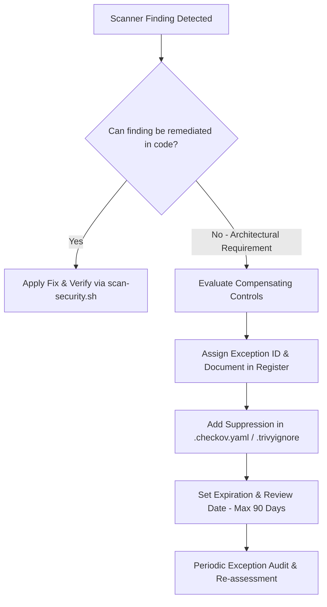

# DevSecOps Risk Acceptance & Security Exceptions Register

Centralized risk acceptance register and security exception governance policy for the `homelab-iac` repository. All suppressions in static analysis scanners ([`.checkov.yaml`](file:///root/homelab-iac/.checkov.yaml), [`.trivy.yaml`](file:///root/homelab-iac/.trivy.yaml), and [`.trivyignore`](file:///root/homelab-iac/.trivyignore)) must be cataloged here with clear technical justification, compensating mitigations, and formal expiration dates.

---

## 🛡️ Exception Governance & Lifecycle Policy

Every security finding identified by static analysis or vulnerability scanning (Checkov, Trivy, Gitleaks, ShellCheck, OpenTofu) must be addressed through one of three pathways:

1. **Remediation**: Fix the root cause in OpenTofu HCL, Docker Compose, or shell scripts.
2. **Architecture Exception (Documented Here)**: Formally accept the risk when required for functional, hardware, or third-party appliance constraints.
3. **Temporary Exemption**: Time-bound suppression (maximum 90-day review cycle) with active tracking.

### Risk Acceptance Review Standards
- **Maximum Exemption Duration**: 90 days for software CVEs; 1 year for core architectural hardware passthrough decisions (subject to annual audit).
- **Compensating Controls Requirement**: An exception will not be approved without defense-in-depth compensating mitigations (e.g. VLAN isolation, non-root user mapping, firewall egress filtering).
- **Audit Verification**: Run `scripts/scan-security.sh` before merging any infrastructure changes to ensure no undocumented findings bypass CI/CD gates.

---

## 🏗️ Homelab Container Privilege & Architecture Blueprint

The homelab runs a hybrid multi-node Proxmox VE topology comprising the **Utility Node** (`proxmox`), the **Compute Node** (`tuxmox`), and dedicated management/service LXCs:

| CT ID | Host Node | Service / Workload | Privilege Mode | Architecture & Hardware Rationale |
| :--- | :--- | :--- | :--- | :--- |
| **CT 101** | Compute Node (`tuxmox`) | `plex` | Privileged (`unprivileged = false`) | Intel Iris Xe QuickSync GPU passthrough (`/dev/dri/renderD128`, `/dev/dri/card1`) and Synology NAS NFS bind mounts (`/mnt/syno-data`). |
| **CT 102** | Compute Node (`tuxmox`) | `audiobookshelf` | Privileged (`unprivileged = false`) | Synology NAS NFS volume bind mounts for media library access. |
| **CT 201** | Utility Node (`proxmox`) | `seedbox` | Privileged (`unprivileged = false`) | Nested Docker, WireGuard TUN kernel device (`/dev/net/tun`), Synology NAS CIFS/NFS mounts. Gluetun uses `CAP_NET_ADMIN` and `no-new-privileges:true`. |
| **CT 301** | Compute Node (`tuxmox`) | `immich` | Privileged (`unprivileged = false`) | Nested Docker, Intel Iris Xe GPU passthrough (`/dev/dri/renderD128`, `/dev/dri/card1`), Synology NAS photo library mount (`/mnt/syno-photos`). Stack: Immich Server, Machine Learning, PostgreSQL 14 (VectorChord), Valkey Redis (`valkey:8-bookworm`). |
| **CT 401** | Compute Node (`tuxmox`) | `teamspeak` | Privileged (`unprivileged = false`) | Nested Docker. TeamSpeak 6 server uses native embedded SQLite (`tsserver.sqlitedb`), direct port bindings UDP 9987 & TCP 30033 with non-root user `1000:1000`. |
| **CT 501** | Utility Node (`proxmox`) | `adguard` (Primary) | Privileged (`unprivileged = false`) | Raw socket and low-port binding for DNS (port 53) and DHCP server (port 67). |
| **CT 502** | Compute Node (`tuxmox`) | `adguard` (Secondary) | Privileged (`unprivileged = false`) | Raw socket and low-port binding for HA secondary DNS (port 53) and DHCP server (port 67). |
| **CT 510** | Utility Node (`proxmox`) | `cloudflared` (Primary) | Unprivileged (`unprivileged = true`) | Outbound-only active Cloudflare Zero Trust Tunnel connector. |
| **CT 511** | Compute Node (`tuxmox`) | `cloudflared` (Secondary) | Unprivileged (`unprivileged = true`) | Outbound-only standby HA Cloudflare Zero Trust Tunnel connector. |
| **CT 601** | Utility Node (`proxmox`) | `monitoring` | Privileged (`unprivileged = false`) | Nested Docker running Uptime Kuma monitoring engine (`/opt/monitoring`). |
| **CT 900** | Utility Node (`proxmox`) | `mgmt-devops` | Unprivileged (`unprivileged = true`) | **Management Workspace** for OpenTofu HCL provisioning, git operations, and administrative toolchains. |

---

## 📋 Active Security Exceptions Register

| Exception ID | Tool / Check ID | Affected Target / Resource | Severity | Justification & Architectural Constraint | Compensating Mitigating Controls | Owner / Approver | Expiration / Review Cycle |
| :--- | :--- | :--- | :--- | :--- | :--- | :--- | :--- |
| **EXC-001** | `CKV_DOCKER_2` `AVD-DS-0002` | `stacks/*/docker-compose.yml` | `LOW` | Third-party container images (e.g. `linuxserver/*`, `teamspeaksystems/*`, `ghcr.io/immich-app/*`, `docker.io/valkey/*`) do not declare native Docker `HEALTHCHECK` directives. | External health monitoring is actively performed by Uptime Kuma (`CT 601` on Utility Node `proxmox`) via HTTP/TCP probe checks every 30 seconds with immediate Discord alert dispatches. | DevSecOps Lead | 2027-01-01 (Annual Review) |
| **EXC-002** | `CKV_DOCKER_11` `AVD-DS-0011` | `stacks/teamspeak/docker-compose.yml` (`CT 401`) | `MEDIUM` | TeamSpeak 6 server requires direct UDP port 9987 (voice traffic) and TCP port 30033 (file transfer) binding for low-latency VoIP client packet streaming and server query. | Isolated LXC container (`CT 401`) on Compute Node (`tuxmox`), native embedded SQLite database (`tsserver.sqlitedb`) with no external database daemon or exposed DB ports, non-root user execution (`1000:1000`), sensitive query port `10011` disabled, and host firewall filtering. | DevSecOps Lead | 2027-01-01 (Annual Review) |
| **EXC-003** | `CKV_DOCKER_8` `AVD-DS-0001` | `stacks/seedbox/docker-compose.yml` (`gluetun`, `CT 201`) | `MEDIUM` | Gluetun VPN container requires elevated capability `NET_ADMIN` and initial root execution to configure the `/dev/net/tun` interface and manage WireGuard routing tables. | Strict Docker security option `no-new-privileges:true` is enforced; network namespace isolation routes all child torrent traffic strictly over VPN with built-in killswitch preventing IP leaks; isolated on `CT 201` on Utility Node (`proxmox`). | DevSecOps Lead | 2027-01-01 (Annual Review) |
| **EXC-004** | `CKV_PVE_PRIVILEGED` `tofu/ct-plex.tf` | `tofu/ct-plex.tf` (`CT 101: plex`) | `HIGH` | Plex LXC is configured as a Privileged container (`unprivileged = false`) to enable direct Intel Iris Xe (64 EUs) QuickSync GPU hardware passthrough (`/dev/dri/renderD128` & `/dev/dri/card1`) and Synology NAS NFS bind mounts (`/mnt/syno-data`). | Container is pinned to Compute Node `tuxmox` (`10.0.0.151`); SSH root password login is disabled (Ed25519 public key authentication only); media directories are scoped with strict permissions; isolated from management VLAN. | DevSecOps Lead | 2027-01-01 (Annual Review) |
| **EXC-005** | `CKV_PVE_PRIVILEGED` `tofu/ct-seedbox.tf` | `tofu/ct-seedbox.tf` (`CT 201: seedbox`) | `MEDIUM` | Seedbox LXC is configured as Privileged (`unprivileged = false`) to support nested Docker, WireGuard TUN device (`/dev/net/tun`), and Synology NAS CIFS/NFS mounts. | Pinned to Utility Node `proxmox` (`10.0.0.101`); network traffic is fully encapsulated via AirVPN WireGuard with killswitch active; egress to local LAN is restricted to required management subnets (`10.0.0.0/24`); SSH public-key authentication only. | DevSecOps Lead | 2027-01-01 (Annual Review) |
| **EXC-006** | `GITLEAKS_TEMPLATE` `secrets.env.example` | `secrets.env.example` `secrets.env.op.tmpl` | `LOW` | Template files contain variable placeholders and synthetic mock keys (e.g. `CLOUDFLARE_API_TOKEN="xxxxxxxx"`) intended for bootstrapping and 1Password integration. | Git repository enforces strict `.gitignore` patterns preventing actual `homelab-secrets.env` and `.env` files from ever entering commit history. Pre-commit Gitleaks hook scans staging index. | DevSecOps Lead | 2027-01-01 (Annual Review) |

---

## 🔍 Detailed Exception Technical Analyses

### 1. EXC-001: Missing Container Healthcheck Directives
- **Check IDs**: `CKV_DOCKER_2`, `AVD-DS-0002`
- **Severity**: Low
- **Description**: Docker Compose services omit embedded `healthcheck` blocks in their service definitions.
- **Architectural Context**: Upstream multi-architecture container images (e.g. `linuxserver/*`, `teamspeaksystems/*`) often omit embedded healthchecks or modify internal health checking paths across minor releases.
- **Compensating Controls**:
  1. Primary external monitoring by [Uptime Kuma](file:///root/homelab-iac/stacks/monitoring/docker-compose.yml) (`CT 601` on Utility Node `proxmox`) executing scheduled HTTP/TCP probes every 30 seconds.
  2. Automatic incident webhook notifications dispatched directly to the Homelab Discord Alert Channel via [`setup-discord-alerts.sh`](file:///root/homelab-iac/scripts/setup-discord-alerts.sh).
  3. Proxmox-level systemd service watchdog and auto-restart policies configured across all LXC hosts.

### 2. EXC-002: TeamSpeak Direct Host Port Binding
- **Check IDs**: `CKV_DOCKER_11`, `AVD-DS-0011`
- **Severity**: Medium
- **Description**: Exposure of UDP 9987 (voice traffic) and TCP 30033 (file transfer) directly on container host interfaces.
- **Architectural Context**: Real-time voice latency requires direct UDP routing without HTTP reverse-proxy encapsulation overhead.
- **Compensating Controls**:
  1. Container executes explicitly with unprivileged user `1000:1000`.
  2. Database backend utilizes native embedded SQLite (`tsserver.sqlitedb`) persisted to `/var/tsserver`, eliminating any external database service, exposed DB ports, or MariaDB dependencies.
  3. Sensitive server query port `10011` is commented out / disabled by default in `docker-compose.yml`.
  4. Workload is isolated within `CT 401` on Compute Node `tuxmox` (`10.0.0.61`) behind firewall filtering.

### 3. EXC-003: Gluetun VPN Elevated `NET_ADMIN` Capability
- **Check IDs**: `CKV_DOCKER_8`, `AVD-DS-0001`
- **Severity**: Medium
- **Description**: Container is granted `CAP_NET_ADMIN` and initiates startup as root user.
- **Architectural Context**: WireGuard VPN interface setup, iptables policy enforcement, and routing table manipulation inside Linux network namespaces require kernel network administration capabilities.
- **Compensating Controls**:
  1. `security_opt: [no-new-privileges:true]` prevents privilege escalation beyond declared capabilities.
  2. All dependent containers (`qbittorrent`, `prowlarr`, etc.) share Gluetun's network namespace (`network_mode: service:gluetun`), preventing any outbound internet traffic if the VPN tunnel drops (built-in killswitch).
  3. Inbound traffic is strictly firewalled to specified LAN subnets (`FIREWALL_OUTBOUND_SUBNETS=10.0.0.0/24`) on `CT 201` on Utility Node `proxmox`.

### 4. EXC-004: Plex LXC Privileged Mode for Intel QuickSync GPU Passthrough
- **Check IDs**: `CKV_PVE_PRIVILEGED`, OpenTofu Security
- **Severity**: High (Architectural)
- **Description**: Container `CT 101` (`plex`) is provisioned with `unprivileged = false` in [`ct-plex.tf`](file:///root/homelab-iac/tofu/ct-plex.tf).
- **Architectural Context**: Direct hardware passthrough of Intel 13th Gen Iris Xe iGPU (`/dev/dri/renderD128`, `/dev/dri/card1`) and Synology NAS NFS bind mounts (`/mnt/syno-data`) require consistent kernel UID/GID ownership and device node access in Proxmox VE.
- **Compensating Controls**:
  1. SSH access to `CT 101` enforces Ed25519 public key authentication only (`PasswordAuthentication no`).
  2. Plex server web UI is protected by Cloudflare Zero Trust Access and local subnet access control.
  3. Automated Proxmox backup snapshots scheduled nightly to Synology NAS via [`setup-proxmox-nas-backups.sh`](file:///root/homelab-iac/scripts/setup-proxmox-nas-backups.sh).
  4. Pinned to Compute Node `tuxmox` (`10.0.0.151`) with media directories scoped with strict permissions.

### 5. EXC-005: Seedbox LXC Privileged Mode for TUN & NAS Mounts
- **Check IDs**: `CKV_PVE_PRIVILEGED`, OpenTofu Security
- **Severity**: Medium (Architectural)
- **Description**: Container `CT 201` (`seedbox`) is provisioned with `unprivileged = false` in [`ct-seedbox.tf`](file:///root/homelab-iac/tofu/ct-seedbox.tf).
- **Architectural Context**: Seedbox LXC requires privileged execution to host nested Docker containers, allocate the Linux kernel WireGuard TUN character device (`/dev/net/tun`), and mount Synology NAS media shares (`/mnt/syno-data`).
- **Compensating Controls**:
  1. Container is pinned to Utility Node `proxmox` (`10.0.0.101`) with SSH public-key authentication enforced.
  2. All external internet traffic is encapsulated inside AirVPN WireGuard with an active firewall killswitch; LAN egress is restricted to the management subnet (`10.0.0.0/24`).
  3. Nested Docker containers enforce `no-new-privileges:true` and unprivileged UID mapping where applicable.

### 6. EXC-006: Gitleaks Synthetic Secrets Suppression
- **Check IDs**: `GITLEAKS_TEMPLATE`, Gitleaks / Secret Scanning
- **Severity**: Low
- **Description**: Static analysis scanners flag variable placeholders and dummy credentials in configuration template files.
- **Architectural Context**: Example bootstrapping files (e.g. `secrets.env.example`, `secrets.env.op.tmpl`) contain synthetic placeholder tokens (e.g. `CLOUDFLARE_API_TOKEN="xxxxxxxx"`) to guide operators during initial deployment and 1Password CLI injection.
- **Compensating Controls**:
  1. Strict `.gitignore` policy excludes actual secret files (`homelab-secrets.env`, `.env`, `*.key`, `*.pem`) from git tracking.
  2. Pre-commit hooks run Gitleaks on all staged changes prior to commit creation.
  3. Production secrets are loaded directly into memory or injected into `.env` files with permissions set to `0600` via 1Password CLI (`op`).

---

## 🔄 Exception Audit and Renewal Procedure

1. **Quarterly Review**: The DevSecOps Engineer must run `scripts/scan-security.sh` and inspect all active exceptions against updated vendor releases.
2. **Revocation**: When an upstream vendor adds native unprivileged support or embedded healthchecks, the corresponding suppression must be removed from [`.checkov.yaml`](file:///root/homelab-iac/.checkov.yaml) and [`.trivyignore`](file:///root/homelab-iac/.trivyignore).
3. **Incident Escalation**: Any vulnerability discovered in an excepted component must immediately trigger a re-assessment of compensating controls.
