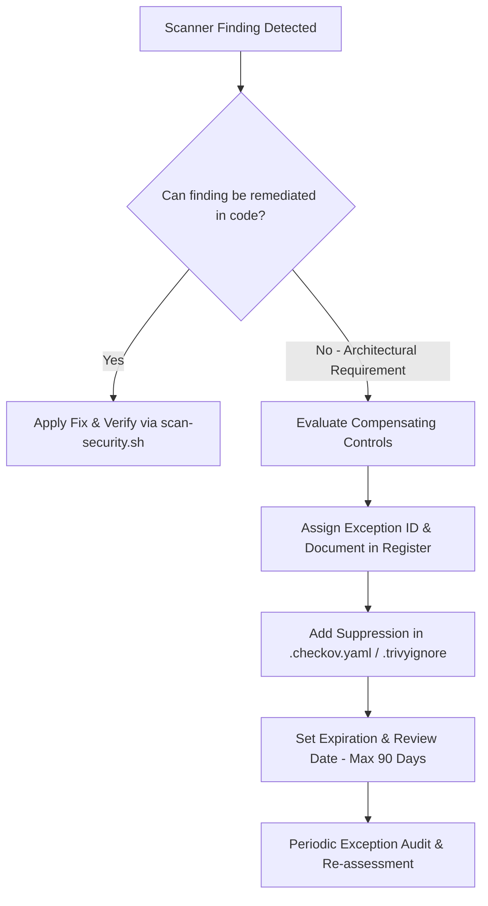

# DevSecOps Risk Acceptance & Security Exceptions Register

Centralized risk acceptance register and security exception governance policy for the `homelab-iac` repository. All suppressions in static analysis scanners ([`.checkov.yaml`](file:///root/homelab-iac/.checkov.yaml), [`.trivy.yaml`](file:///root/homelab-iac/.trivy.yaml), and [`.trivyignore`](file:///root/homelab-iac/.trivyignore)) must be cataloged here with clear technical justification, compensating mitigations, and formal expiration dates.

---

## 🛡️ Exception Governance & Lifecycle Policy

Every security finding identified by static analysis or vulnerability scanning (Checkov, Trivy, Gitleaks, ShellCheck, OpenTofu) must be addressed through one of three pathways:

1. **Remediation**: Fix the root cause in OpenTofu HCL, Docker Compose, or shell scripts.
2. **Architecture Exception (Documented Here)**: Formally accept the risk when required for functional, hardware, or third-party appliance constraints.
3. **Temporary Exemption**: Time-bound suppression (maximum 90-day review cycle) with active tracking.

### Risk Acceptance Review Standards
- **Maximum Exemption Duration**: 90 days for software CVEs; 1 year for core architectural hardware passthrough decisions (subject to annual audit).
- **Compensating Controls Requirement**: An exception will not be approved without defense-in-depth compensating mitigations (e.g. VLAN isolation, non-root user mapping, firewall egress filtering).
- **Audit Verification**: Run `scripts/scan-security.sh` before merging any infrastructure changes to ensure no undocumented findings bypass CI/CD gates.

---

### 🏗️ Homelab Container Privilege & Architecture Blueprint

The homelab runs a hybrid multi-node Proxmox VE topology comprising the **Utility Node** (`node-1`), the **Compute Node** (`node-2`), and dedicated management/service LXCs:

| CT ID | Host Node | Service / Workload | Privilege Mode | Architecture & Hardware Rationale |
| :--- | :--- | :--- | :--- | :--- |
| **CT 501** | Utility Node (`node-1`) | `adguard` (Primary) | Privileged (`unprivileged = false`) | Raw socket and low-port binding for DNS (port 53) and DHCP server (port 67). |
| **CT 502** | Compute Node (`node-2`) | `adguard` (Secondary) | Privileged (`unprivileged = false`) | Raw socket and low-port binding for HA secondary DNS (port 53) and DHCP server (port 67). |
| **CT 510** | Utility Node (`node-1`) | `cloudflared` (Primary) | Unprivileged (`unprivileged = true`) | Outbound-only active Cloudflare Zero Trust Tunnel connector. |
| **CT 511** | Compute Node (`node-2`) | `cloudflared` (Secondary) | Unprivileged (`unprivileged = true`) | Outbound-only standby HA Cloudflare Zero Trust Tunnel connector. |
| **CT 601** | Utility Node (`node-1`) | `monitoring` | Privileged (`unprivileged = false`) | Nested Docker running Uptime Kuma monitoring engine (`/opt/monitoring`). |
| **CT 900** | Utility Node (`node-1`) | `mgmt-devops` | Unprivileged (`unprivileged = true`) | **Management Workspace** for OpenTofu HCL provisioning, git operations, and administrative toolchains. |

---

## 📋 Active Security Exceptions Register

| Exception ID | Tool / Check ID | Affected Target / Resource | Severity | Justification & Architectural Constraint | Compensating Mitigating Controls | Owner / Approver | Expiration / Review Cycle |
| :--- | :--- | :--- | :--- | :--- | :--- | :--- | :--- |
| **EXC-001** | `CKV_DOCKER_2` `AVD-DS-0002` | `stacks/*/docker-compose.yml` | `LOW` | Third-party container images do not declare native Docker `HEALTHCHECK` directives. | External health monitoring is actively performed by Uptime Kuma (`CT 601` on Utility Node `node-1`) via HTTP/TCP probe checks every 30 seconds with immediate Discord alert dispatches. | DevSecOps Lead | 2027-01-01 (Annual Review) |
| **EXC-002** | `GITLEAKS_TEMPLATE` `secrets.env.example` | `secrets.env.example` | `LOW` | Template files contain variable placeholders and synthetic mock keys intended for bootstrapping and 1Password integration. | Git repository enforces strict `.gitignore` patterns preventing actual `secrets.env` and `.env` files from ever entering commit history. Pre-commit Gitleaks hook scans staging index. | DevSecOps Lead | 2027-01-01 (Annual Review) |

---

## 🔍 Detailed Exception Technical Analyses

### 1. EXC-001: Missing Container Healthcheck Directives
- **Check IDs**: `CKV_DOCKER_2`, `AVD-DS-0002`
- **Severity**: Low
- **Description**: Docker Compose services omit embedded `healthcheck` blocks in their service definitions.
- **Architectural Context**: Upstream multi-architecture container images often omit embedded healthchecks or modify internal health checking paths across minor releases.
- **Compensating Controls**:
  1. Primary external monitoring by [Uptime Kuma](file:///root/homelab-iac/stacks/monitoring/docker-compose.yml) (`CT 601` on Utility Node `node-1`) executing scheduled HTTP/TCP probes every 30 seconds.
  2. Automatic incident webhook notifications dispatched directly to the Homelab Discord Alert Channel via [`setup-discord-alerts.sh`](file:///root/homelab-iac/scripts/setup-discord-alerts.sh).
  3. Proxmox-level systemd service watchdog and auto-restart policies configured across all LXC hosts.

### 2. EXC-002: Gitleaks Synthetic Secrets Suppression
- **Check IDs**: `GITLEAKS_TEMPLATE`, Gitleaks / Secret Scanning
- **Severity**: Low
- **Description**: Static analysis scanners flag variable placeholders and dummy credentials in configuration template files.
- **Architectural Context**: Example bootstrapping files (e.g. `secrets.env.example`) contain synthetic placeholder tokens to guide operators during initial deployment and 1Password CLI injection.
- **Compensating Controls**:
  1. Strict `.gitignore` policy excludes actual secret files (`secrets.env`, `homelab-secrets.env`, `.env`, `*.key`, `*.pem`) from git tracking.
  2. Pre-commit hooks run Gitleaks on all staged changes prior to commit creation.
  3. Production secrets are loaded directly into memory or injected into `.env` files with permissions set to `0600` via 1Password CLI (`op`).

---

## 🔄 Exception Audit and Renewal Procedure

1. **Quarterly Review**: The DevSecOps Engineer must run `scripts/scan-security.sh` and inspect all active exceptions against updated vendor releases.
2. **Revocation**: When an upstream vendor adds native unprivileged support or embedded healthchecks, the corresponding suppression must be removed from [`.checkov.yaml`](file:///root/homelab-iac/.checkov.yaml) and [`.trivyignore`](file:///root/homelab-iac/.trivyignore).
3. **Incident Escalation**: Any vulnerability discovered in an excepted component must immediately trigger a re-assessment of compensating controls.
