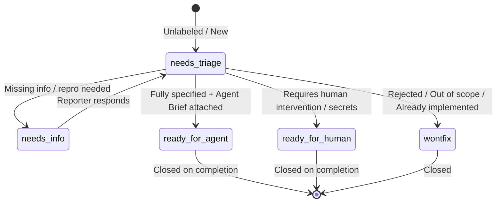

# Triage Labels

The repository issue tracker uses five canonical state labels and two category labels to govern issue lifecycle and agent dispatch.

## Canonical Labels

| Canonical Role | Tracker Label | Type | Meaning | Next Action / Operational Guideline |
| :--- | :--- | :--- | :--- | :--- |
| `needs-triage` | `needs-triage` | State | Maintainer needs to evaluate this issue | Run `/triage` to classify, verify, and attach notes or briefs. |
| `needs-info` | `needs-info` | State | Waiting on reporter for more information | Blocked until reporter responds with reproduction details or clarification. |
| `ready-for-agent` | `ready-for-agent` | State | Fully specified, ready for an AFK agent | Agent brief attached or decomposed via `/to-tickets`. Can be picked up autonomously. |
| `ready-for-human` | `ready-for-human` | State | Requires human implementation | Needs manual secrets, physical hardware access, architectural decisions, or manual verification. |
| `wontfix` | `wontfix` | State | Will not be actioned | Issue is closed with reasoning or logged in `.out-of-scope/`. |
| `bug` | `bug` | Category | Something is broken | Investigate, reproduce, and fix. |
| `enhancement` | `enhancement` | Category | New feature or improvement | Scope, design, and implement. |

Each triaged issue should carry exactly one category label (`bug` or `enhancement`) and one active state label.

## State Transitions



## Skill Interactions

- **`/triage`**: Inspects unlabeled issues and `needs-triage` backlog, performs verification/reproduction, requests info, or attaches an **Agent Brief** before promoting to `ready-for-agent` or `ready-for-human`.
- **`/to-spec` & `/to-tickets`**: Automatically applies `ready-for-agent` upon ticket generation, as tickets are created atomic, vertically sliced, and pre-specified by construction.
- **Autonomous Agents / Wayfinder**: Queries issues with `ready-for-agent` to claim, implement, validate against repo pre-commit/tofu checks, and resolve.

## GitHub CLI Operations

Use the `gh` CLI for label operations (see [issue-tracker.md](file:///root/homelab-iac/docs/agents/issue-tracker.md)):

- **List issues needing triage:**
  ```bash
  gh issue list --state open --label "needs-triage"
  ```
- **List items ready for agent pickup:**
  ```bash
  gh issue list --state open --label "ready-for-agent"
  ```
- **Transition an issue to ready-for-agent:**
  ```bash
  gh issue edit <number> --add-label "ready-for-agent" --remove-label "needs-triage"
  ```
- **Move an issue to needs-info:**
  ```bash
  gh issue edit <number> --add-label "needs-info" --remove-label "needs-triage"
  ```
- **Close as wontfix:**
  ```bash
  gh issue close <number> --reason "not planned" --comment "> *This was generated by AI during triage.*&#10;&#10;Closing as wontfix."
  ```
